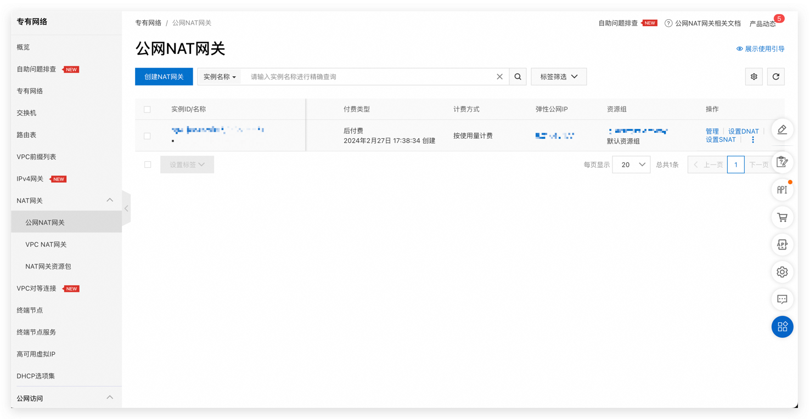
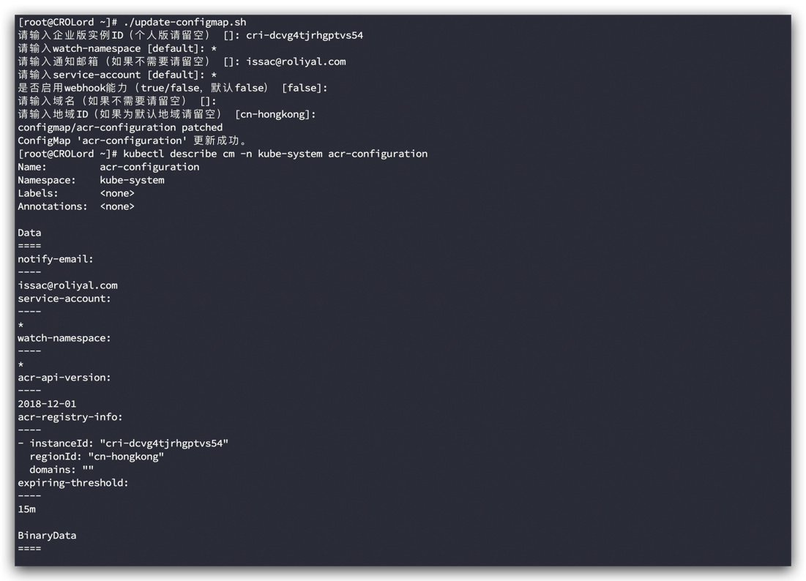
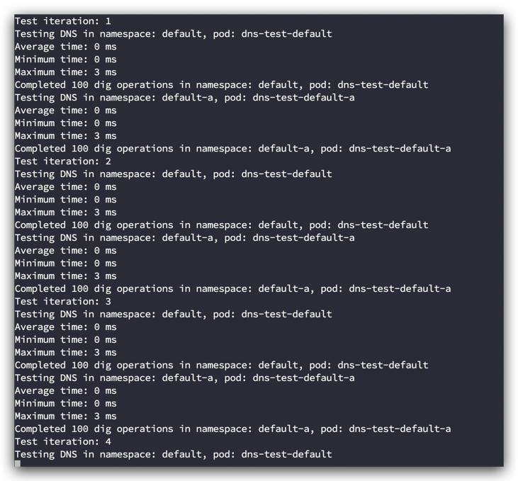

# CICD工具集整合

成功实现持续集成（CI）和持续交付（CD）需要以下几个关键步骤：

* **版本控制系统（VCS）**：CI的基石是版本控制。Git是目前最流行的VCS，它允许多名开发者同时工作在同一个项目上，而不会互相干扰。
* **测试驱动开发（TDD）**：TDD是一种软件开发过程，要求开发者在编写实际代码之前先编写测试用例。
* **集成环境的要求**：CI流程需要专门的服务器或服务来执行构建和测试任务。工具如Jenkins、Travis CI和CircleCI等提供了灵活的配置选项来满足不同项目的需求。

## Jenkins 使用与配置

1. 自定义Jenkins环境配置
   1. 使用以下命令查看具体的Helm values字段含义，以及参考在线文档：

```shell
helm show values <Helm仓库>/<Helm镜像名>
```

2. 在线文档参考：[Jenkins Helm 参数参考集](https://github.com/jenkinsci/helm-charts/blob/main/charts/jenkins/VALUES.md)
3. 在values.yaml中配置Jenkins环境，以下是配置示例为生产可用配置：

```yaml
# 持久化存储配置
persistence:
  enabled: true
  storageClass: "alicloud-disk-topology-alltype" #依次尝试创建指定的存储类型，并且使用WaitForFirstConsumer模式，可以兼容多可用区集群。 [参考StorageClass](https://help.aliyun.com/zh/ack/ack-managed-and-ack-dedicated/user-guide/disk-volume-overview-3#p-y0r-qmp-hxh)
  accessMode: ReadWriteOnce
  size: "100Gi"
  #subPath: "jenkins_home"
  # 以下部分为高级配置，如不需要可保持当前状态
  #existingClaim: jenkins-data
  annotations: {}
  labels: {}
  dataSource:
  volumes:
  mounts:

# JCasC 配置项
controller:
  usePodSecurityContext: true
  containerSecurityContext:
    runAsUser: 1000
    runAsGroup: 1000
    readOnlyRootFilesystem: true
    allowPrivilegeEscalation: true
  componentName: "jenkins-controller"
  image:
    registry: "docker.io"
    repository: "jenkins/jenkins"
    tag: "2.458"
    #tagLabel: jdk17
    pullPolicy: "Always"
  # JCasC - 用户登录密码用户名配置
  #adminSecret: true
  #createSecret: true
  admin:
    createSecret: true
    existingSecret: "jenkins-admin-secret"
    userKey: "jenkins-admin-user"
    passwordKey: "jenkins-admin-password"
  #配置时区
  javaOpts: "-Duser.timezone=Asia/Shanghai -Dorg.jenkinsci.plugins.durabletask.BourneShellScript.USE_BINARY_WRAPPER=true"
  #配置插件
  installPlugins:
    - persistent-parameter:1.3
    - workflow-multibranch:783.va_6eb_ef636fb_d
    - kubernetes:4203.v1dd44f5b_1cf9
    - workflow-aggregator:latest
    - git:5.2.1
    - configuration-as-code:1775.v810dc950b_514
    - job-dsl:1.87
    - docker-build-publish:1.4.0
    - sshd:3.322.v159e91f6a_550
    - ws-cleanup:0.45
    - gson-api:2.10.1-15.v0d99f670e0a_7
    - github:1.38.0
    - build-name-setter:2.4.1
    - versionnumber:1.11
    - dingding-notifications:2.7.3
    - docker-workflow:572.v950f58993843
    - kubernetes-credentials-provider:1.262.v2670ef7ea_0c5
    - github-branch-source:1787.v8b_8cd49a_f8f1
    - build-name-setter:2.4.2
    - build-environment:1.7
    - sonar:2.17.2
    - pipeline-utility-steps:2.16.2
    - http_request:1.18
  existingSecret: "secret-credentials"
  additionalExistingSecrets:
    - name: secret-credentials
      keyName: ACR_USERNAME
    - name: secret-credentials
      keyName: ACR_PASSWORD
    - name: secret-credentials
      keyName: k8s-uat-config
    - name: secret-credentials
      keyName: k8s-prod-config
    - name: secret-credentials
      keyName: github-token
    - name: secret-credentials
      keyName: access_key_id
    - name: secret-credentials
      keyName: access_key_secret
    - name: secret-credentials
      keyName: token
    - name: secret-credentials
      keyName: sonar
  JCasC:
    defaultConfig: true
    configScripts:
      #用于定义预设jenkins 全局凭据，此选项为可选，如不需要则删除这段配置
      jenkins-casc-configs-credentials: |
        credentials:
          system:
            domainCredentials:
            - credentials:
              - string:
                  description: "sonarqube"
                  id: "sonar"
                  scope: GLOBAL
                  secret: ${secret-credentials-sonar}
              - string:
                  description: "AccessKey ID "
                  id: "access_key_id"
                  scope: GLOBAL
                  secret: ${secret-credentials-access_key_id}
              - string:
                  description: "AccessKey Secret"
                  id: "access_key_secret"
                  scope: GLOBAL
                  secret: ${secret-credentials-access_key_secret}
              - string:
                  description: "token"
                  id: "token"
                  scope: GLOBAL
                  secret: ${secret-credentials-token}
              - string:
                  description: "Kubernetes Token PROD"
                  id: "k8s_token-prod"
                  scope: GLOBAL
                  secret: ${secret-credentials-k8s-prod-config}
              - string:
                  description: "Kubernetes Token UAT"
                  id: "k8s_token_uat"
                  scope: GLOBAL
                  secret: ${secret-credentials-k8s-uat-config}
              - string:
                  description: "GitHub Token or Gitlab Token"
                  id: "github_token"
                  scope: GLOBAL
                  secret: ${secret-credentials-github-token}
              - usernamePassword:
                  description: "ACR Registry Credentials"
                  id: "acr_registry_credentials"
                  password: ${secret-credentials-ACR_PASSWORD}
                  scope: GLOBAL
                  username: ${secret-credentials-ACR_USERNAME}
      my-jobs: |
        jobs:
          - script: >
              job('demo-job') {
                  steps {
                      shell('echo Hello World')
                  }
              }
      update-center: |
        jenkins:
          updateCenter:
            sites:
              - id: "default"
                #如 dingding通知则需要配置官方源
                url: "https://updates.jenkins.io/update-center.json"
                #url: "https://mirrors.aliyun.com/jenkins/updates/update-center.json"
      my-jenkins-views: |
        jenkins:
          views:
            - list:
                name: "FEBEseparation-UAT"
                description: "FEBE separation UAT view"
               #jobNames:
                # - "demo-job"
                columns:
                  - "status"
                  - "weather"
                  - "jobName"
                  - "lastSuccess"
                  - "lastFailure"
                  - "lastDuration"
                  - "buildButton"
            - list:
                name: "FEBEseparation-Prod"
                description: "FEBE separation Production view"
                # jobNames:
            - list:
                name: "Microservice-UAT"
                description: "Microservice UAT view"
            - list:
                name: "Microservice-Prod"
                description: "Microservice Production view"

  #ingress 控制器设置
  serviceType: ClusterIP
  servicePort: 8080
  ingress:
    enabled: true
    apiVersion: "networking.k8s.io/v1"
    hostName: "jenkins.roliyal.com"
    annotations:
      nginx.ingress.kubernetes.io/rewrite-target: /
      nginx.ingress.kubernetes.io/ssl-redirect: "true"
    ingressClassName: mse # 因使用 mse 云原生网关，ingressclass名需根据实际填写
    tls:
      - secretName: "jenkinstls"
        hosts:
          - "jenkins.roliyal.com"

# RBAC配置-默认开启
rbac:
  create: true
  readSecrets: true

# Prometheus监控配置
prometheus:
  enabled: true

# Jenkins代理配置
agent:
  enabled: true
  defaultsProviderTemplate: ""
  jenkinsUrl:
  jenkinsTunnel:
  kubernetesConnectTimeout: 5
  kubernetesReadTimeout: 15
  maxRequestsPerHostStr: "32"
  namespace: cicd
  image:
    repository: "jenkins/inbound-agent"
    tag: "latest"
  workingDir: "/home/jenkins/agent"
  nodeUsageMode: "NORMAL"
  customJenkinsLabels: []
  imagePullSecretName:
  componentName: "jenkins-agent"
  websocket: false
  privileged: true
  runAsUser: 0
  runAsGroup: 0
  resources:
    requests:
      cpu: "1024m"
      memory: "1024Mi"
    limits:
      cpu: "4096"
      memory: "4096Mi"
  alwaysPullImage: true
  podRetention: "Never"
  showRawYaml: false
  workspaceVolume: {}
  envVars: []
  #nodeSelector: {}
  command:
  args: "${computer.jnlpmac} ${computer.name}"
  sideContainerName: "jnlp"
  TTYEnabled: true
  containerCap: 10
  podName: "jenkins-slave"
  idleMinutes: 0
  yamlTemplate: ""
  yamlMergeStrategy: "override"
  connectTimeout: 100
  annotations: {}
  podTemplates:
    kanikoarm: |
      - name: kanikoarm
        label: kanikoarm
        serviceAccount: jenkins
        nodeSelector: "beta.kubernetes.io/arch=arm64"
        containers:
          - name: kanikoarm
            image: gcr.io/kaniko-project/executor:v1.22.0-debug 
            command: "sh -c"
            args: "cat"
            ttyEnabled: true
            privileged: false
            #resourceRequestCpu: "1000m"
            #resourceRequestMemory: "512Mi"
            #resourceLimitCpu: "2"
            #resourceLimitMemory: "2048Mi"
          - name: jnlp
            image: jenkins/inbound-agent:latest
            command: "jenkins-agent"
            args: ""
            ttyEnabled: true
            privileged: false
        volumes:
          - secretVolume:
              secretName: kaniko-secret
              mountPath: "/kaniko/.docker"
    kanikoamd: |
      - name: kanikoamd
        label: kanikoamd
        serviceAccount: jenkins
        nodeSelector: "beta.kubernetes.io/arch=amd64" #lables取自阿里云kubernetes 容器服务节点标签 
        containers:
          - name: kanikoamd
            image: docker.io/crolord/kanikomanifest-tool:v1.2.2 #镜像版本为AMD架构，其中封装 kaniko、 trivy 、Manifest-tools、 sonarqunbe 工具
            command: "sh -c"
            args: "cat"
            ttyEnabled: true
            privileged: false
            #resourceRequestCpu: "1000m"
            #resourceRequestMemory: "512Mi" 
            #resourceLimitCpu: "2"
            #resourceLimitMemory: "2048Mi"
          - name: jnlp
            image: jenkins/inbound-agent:latest
            command: "jenkins-agent"
            args: ""
            ttyEnabled: true
            privileged: false
        volumes:
          - secretVolume:
              secretName: kaniko-secret
              mountPath: "/kaniko/.docker"       
    podman: |
      - name: podman
        label: podman
        serviceAccount: default
        nodeSelector: "beta.kubernetes.io/arch=amd64" #lables取自阿里云kubernetes 容器服务节点标签 
        containers:
          - name: podman
            image: crolord/podman:latest #该镜像目前支持 amd64 架构
            command: "/bin/sh -c"
            args: "cat"
            ttyEnabled: true
            privileged: true
        volumes:
          - hostPathVolume:
              hostPath: "/sys"
              mountPath: "/sys"
    docker: |
      - name: docker
        label: docker
        serviceAccount: default
        containers:
          - name: docker
            image: docker:dind
            command: "/bin/sh -c"
            args: "cat"
            ttyEnabled: true
            privileged: true
        volumes:
          - hostPathVolume:
              hostPath: "/var/run/docker.sock"
              mountPath: "/var/run/docker.sock"
  volumes:
    - type: HostPath
      hostPath: /var/lib/containers
      mountPath: /var/lib/containers
    - type: HostPath
      hostPath: /sys
      mountPath: /sys
```

4. sonarqube 配置 jenins 凭据，以下数据通过 "echo -n 'your_sonarqube_id' | base64 生成，需要根据实际 data 字段改变

```shell
kubectl patch secret secret-credentials -n cicd --patch='
 data:
   sonar: "*****ASDASDADAS******"
 '
```

5. 持久化存储配置 (persistence)

- enabled: 开关项，当设置为true时，启用持久化存储，保证Jenkins数据（如作业配置、历史记录等）在Pod重新部署后依然保留。
- storageClass: 指定Kubernetes中定义的存储类别名称，此处为alicloud-disk-topology-alltype。不同的存储类别可能支持不同的性能、价格和可用区部署策略。WaitForFirstConsumer模式意味着卷的创建将延迟到Pod被调度到具体节点上，详细 StorageClass 配置，参考[StorageClass](https://help.aliyun.com/zh/ack/ack-managed-and-ack-dedicated/user-guide/disk-volume-overview-3#p-y0r-qmp-hxh)
- accessMode: 定义如何访问存储卷。ReadWriteOnce仅允许单个节点以读写模式挂载卷。
- size: 请求的存储卷大小，这里是100Gi。
- annotations, labels: 用于添加额外的注解和标签到存储卷，这些可以用于存储策略或成本中心等的管理。
- dataSource, volumes, mounts: 这些高级配置项用于指定数据来源、额外卷和挂载点，通常用于特殊存储需求或数据迁移。

6. JCasC配置项 (controller)

- usePodSecurityContext, containerSecurityContext: 这些配置定义了Pod和容器的安全约束，例如以指定用户身份运行（避免使用root），禁用文件系统的写入权限等，以增强安全性。
- componentName: 用于Kubernetes标签，有助于资源的组织和管理。
- image: 定义使用的Jenkins镜像，包括镜像仓库地址、镜像标签等。pullPolicy: "Always"意味着Kubernetes将在每次启动容器时尝试拉取最新的镜像。
- admin: 管理Jenkins的管理员用户和密码，可选地从Kubernetes Secret获取。
- javaOpts: Java虚拟机选项，用于自定义Jenkins运行时的Java环境，如设置时区和脚本执行方式。
- installPlugins: 列出需要在Jenkins中安装的插件及其版本。
- JCasC: 使用Jenkins Configuration as Code插件预配置Jenkins，包括凭证、作业、视图等，使配置可以作为代码管理。

7. RBAC配置 (rbac)

- create: 是否自动创建RBAC资源，如角色和角色绑定，以授予Jenkins必要的Kubernetes API权限。
- readSecrets: 是否允许Jenkins读取Kubernetes Secrets，通常用于管理凭证。
- Prometheus监控配置 (prometheus)
- enabled: 是否集成Prometheus监控，用于收集和查看Jenkins的运行指标。

8. Jenkins代理配置 (agent)

- enabled, image, workingDir等: 配置Jenkins代理的基本信息，如启用状态、代理使用的Docker镜像、工作目录等。代理用于执行构建任务，以分担主节点负载。
- resources: 定义代理Pod的资源请求和限制，确保Kubernetes能够根据负载合理调度资源。
- podTemplates: 定义不同场景下的代理模板，如基于不同架构（AMD64/ARM64）或不同工具（Kaniko、Docker、Podman）的构建环境。这些模板使得在不同环境下执行构建任务成为可能。

9. 其他配置

- ingress: 配置外部访问Jenkins服务的入口，包括主机名、TLS证书等。
  - 证书方式可以采用ALB ingress 方式选择三种证书方式， Secret证书 、自动发现证书、AlbConfig指定证书，参考链接 [使用ALB Ingress配置HTTPS监听证书](https://help.aliyun.com/zh/ack/ack-managed-and-ack-dedicated/user-guide/use-an-alb-ingress-to-configure-certificates-for-an-https-listener#context-1h8-lvh-2o5)
- serviceType, servicePort: 指定Jenkins服务的类型（如ClusterIP）和端口，决定如何在Kubernetes内部访问Jenkins。

+ 通过这些配置，可以详细控制Jenkins在Kubernetes环境中的部署方式，包括安全、存储、插件、构建代理等各个方面。配置时，应根据具体需求调整参数，以达到最佳的运行效果和资源利用率。

10. 自定义工具镜像补充

+ docker.io/crolord/kanikomanifest-tool:v1.2.0 镜像 dockerfile 示例

```dockerfile
# 使用 Kaniko 的最新版镜像作为构建阶段名为 plugin
FROM gcr.io/kaniko-project/executor:latest AS plugin

# 使用 manifest-tool 的 Docker 镜像
FROM docker.io/mplatform/manifest-tool:latest AS manifest-tool

# 添加一个构建阶段用来从 bitnami/trivy 镜像中复制 trivy
FROM docker.io/bitnami/trivy:latest AS trivy

# 使用 SonarScanner 的 Docker 镜像
FROM docker.io/sonarsource/sonar-scanner-cli:latest AS sonar-scanner

# 使用 golang 的 Docker 镜像
FROM docker.io/golang:latest AS golang

# 使用 node 的 Docker 镜像
FROM docker.io/node:latest AS node

# 使用 kubectl 的 Docker 镜像
FROM bitnami/kubectl:latest AS kubectl

# 基础镜像 ubuntu 并指定标签，确保构建的一致性
FROM ubuntu:20.04
RUN apt-get update && apt-get install -y software-properties-common && \
    add-apt-repository ppa:openjdk-r/ppa && \
    apt-get update && apt-get install -y openjdk-17-jre-headless && \
    rm -rf /var/lib/apt/lists/*

RUN apt-get update && \
    apt-get install -y wget && \
    wget http://gosspublic.alicdn.com/ossutil/1.7.6/ossutil64 -O /usr/local/bin/ossutil && \
    chmod 755 /usr/local/bin/ossutil && \
    apt-get clean && \
    rm -rf /var/lib/apt/lists/*

ENV JAVA_HOME /usr/lib/jvm/java-17-openjdk-amd64
ENV PATH $PATH:$JAVA_HOME/bin
ENV NODE_PATH /usr/local/lib/node_modules

# 设置 Docker 配置环境变量

ENV DOCKER_CONFIG /kaniko/.docker

# 从 plugin 阶段复制 Kaniko 执行程序
COPY --from=plugin /kaniko/executor /usr/local/bin/kaniko

# 从 manifest-tool 镜像复制 manifest-tool 二进制到当前镜像
COPY --from=manifest-tool /manifest-tool /usr/local/bin/manifest-tool

# 从 trivy 阶段复制 trivy 二进制到当前镜像
COPY --from=trivy /opt/bitnami/trivy/bin/trivy /usr/local/bin/trivy

# 从 sonar-scanner 阶段复制 sonar-scanner 二进制到当前镜像
COPY --from=sonar-scanner /opt/sonar-scanner /opt/sonar-scanner
ENV PATH="/opt/sonar-scanner/bin:${PATH}"

# 从 golang 阶段复制 Go 二进制到当前镜像
COPY --from=golang /usr/local/go /usr/local/go
ENV PATH="/usr/local/go/bin:${PATH}"

# 从 kubectl 阶段复制 kubectl 二进制到当前镜像
COPY --from=kubectl /opt/bitnami/kubectl/bin/kubectl /usr/local/bin/kubectl

# 从 node 阶段复制 Node.js 和 npm 到当前镜像
COPY --from=node /usr/local/bin/node /usr/local/bin/
COPY --from=node /usr/local/lib/node_modules /usr/local/lib/node_modules
COPY --from=node /usr/local/bin/npm /usr/local/bin/npm
COPY --from=node /usr/local/bin/npx /usr/local/bin/npx

RUN ln -sf /usr/local/lib/node_modules/npm/bin/npm-cli.js /usr/local/bin/npm \
    && ln -sf /usr/local/lib/node_modules/npm/bin/npx-cli.js /usr/local/bin/npx


```

至此，jenkins 部署章节结束，如需要额外配置参考上述 values 字段修改，如有问题可以提 issue.

## 如何对接 容器服务 Kubernetes 版 ACK 的最佳实践

1. 创建 容器服务 Kubernetes 版 ACK 选型
   1. **如何选择集群版本**

      - **识别版本号**：

        - 阿里云 ACK Kubernetes 版本号采用 x.y.z-aliyun.n 格式：
          x：主要版本（major version）
          y：次要版本（minor version）
          z：补丁版本（patch version）
          n：阿里云补丁版本（ACK patch version）
          例如，版本号 1.28.3-aliyun.1 表示基于 Kubernetes 1.28.3 版本的第一个阿里云补丁版本。[Kubernetes版本概览及机制](https://help.aliyun.com/zh/ack/ack-managed-and-ack-dedicated/user-guide/support-for-kubernetes-versions)
          关于 Kubernetes 版本号的详细说明，请参见 [Kubernetes Release Versioning.](https://github.com/kubernetes/sig-release/blob/master/release-engineering/versioning.md#kubernetes-release-versioning)
      - **低版本和高版本举例说明**：

        - 在 Kubernetes 的版本中，每个主要和次要版本更新都会引入新的特性、改进现有功能、修复漏洞以及可能的 API 变更,建议您在选择集群版本充分阅读官网文档帮助信息，尤其每个版本中 API 的变更情况，充分考虑后选择集群版本。
          Kubernetes 1.24 版本相较于 1.22 版本的主要改进点包括：

        1. 移除了 Dockershim，需要用户迁移到其他容器(Containerd、安全沙箱)运行时。
        2. Server-Side Apply (SSA) 达到 GA 提供了更好的资源管理方式。
        3. PodSecurity Admission 插件替代了 PodSecurityPolicy（PSP），提供了更简洁的安全管理。
        4. 改进了状态同步和健康检查机制。
           Kubernetes 1.22 版本的特点则主要体现在：
        5. 移除了许多旧的 API 版本，需要用户升级到新的 API。
        6. 增强了安全功能和可观察性，提供了更多的监控和诊断工具。
        7. 优先级和抢占（Priority and Preemption）功能达到 GA，提高了资源调度的灵活性。
        8. 选择合适的版本应根据项目需求、兼容性要求以及特性偏好来决定。
      - **官网文档帮助信息**：
        Kubernetes 版本发布页面：
        这个页面列出了每个版本的详细发布说明，包括新特性、改进、修复以及变更内容。
        [Kubernetes Release Notes](https://kubernetes.io/releases)

        Kubernetes 版本生命周期：
        这个页面提供了各个版本的支持状态，包括何时发布、支持期限等信息。
        [Kubernetes Version Skew Policy](https://kubernetes.io/releases/version-skew-policy/)

        Kubernetes API 变更：
        这个页面列出了每个版本中 API 的变更情况，包括新增的 API、弃用的 API 以及移除的 API。
        [Kubernetes API Changes](https://kubernetes.io/docs/reference/using-api/deprecation-guide/)

        Kubernetes 官方文档：
        这个页面提供了 Kubernetes 的完整文档，包括安装、配置、操作以及各个特性的详细说明。
        [Kubernetes Documentation](https://kubernetes.io/docs/home/)
   2. **单集群 VPC 网段规划策略**

      - **VPC网段以及交换机网关规划**：
        - **核心要求**：选择一个与现有网络结构不冲突的VPC网段，并确保有足够的地址空间以支持未来的扩展需求。
        - **选择原则**：规划VPC网段时，建议选择子网掩码不超过 `/16` 的网段。交换机子网掩码应在 `/17` 到 `/29` 之间，子网掩码越小，可用的IP地址数量越多。
        - 示例：例如，如果现有 VPC 网络使用 `10.0.0.0/12`，可以选择 `192.168.0.0/16` 作为新的VPC网段。
        - 没有多地域部署系统的要求且各系统之间也不需要通过VPC进行隔离，那么推荐使用一个VPC
        - 有多地域部署系统的需求时，必须使用多个VPC。可以通过使用VPC对等连接、VPN网关、云企业网等产品实现跨地域VPC间互通。
          **参考**[VPC网络规格](https://help.aliyun.com/zh/vpc/getting-started/network-planning)
   3. **多集群 VPC 网段规划策略**

      - **多集群 VPC网段以及交换机网关规划**：
        - **核心要求**：
          - 1. 多VPC情况，VPC地址段不重叠，VPC间通过CEN互联。
          - 2. 多集群Pod地址段不重叠。
          - 3. 多集群Pod地址段和Service地址段不能重叠。
        - **示例**：
          - **集群1**：
            - VPC网段：`10.0.0.0/16`
            - Pod网段：`10.1.0.0/16`
            - Service网段：`10.96.0.0/20`
          - **集群2**：
            - VPC网段：`10.2.0.0/16`
            - Pod网段：`10.3.0.0/16`
            - Service网段：`10.97.0.0/20`
              **参考**[多集群VPC网络规格](https://help.aliyun.com/zh/ack/distributed-cloud-container-platform-for-kubernetes)
              **IDC集群与云上互通场景** 当与IDC集群整合时，确保IDC网络与Kubernetes集群的VPC、Pod网段和Service网段不重叠。参考说明[分布式云容器平台ACK one 概述](https://help.aliyun.com/zh/ack/distributed-cloud-container-platform-for-kubernetes/product-overview/ack-one-overview)
   4. **网络插件选择指南**

      1. Terway 与 Flannel 对比，参考地址 [Terway与Flannel对比](https://help.aliyun.com/zh/ack/ack-managed-and-ack-dedicated/user-guide/work-with-terway#section-wiw-s2f-tiw) |
      2. Pod 数量详解
         - Terway 计算逻辑,以`ecs.g8a.large` 举例说明，ENI弹性网卡数量:3，单网卡私有IPv4地址数:6，单网卡IPv6地址数:6

           1. 共享ENI多IP模式计算公式=（ECS支持的弹性网卡数-1）×单个ENI支持的私有IP数（EniQuantity-1）×EniPrivateIpAddressQuantity

           * 计算公式: (3 - 1) × 6 =12 ,故 Terway兼容性可以支持 Pod 最大数量为 12 Pod

           2. 共享ENI多IP模式+Trunk ENI= （ECS支持的弹性网卡数-1）×单个ENI支持的私有IP数（EniQuantity-1）×EniPrivateIpAddressQuantity

           * 计算公式:(3 - 1) × 6 x 1 =13 ,故 Terway兼容性可以支持 Pod 最大数量为 13 Pod

           3. 独占ENI模式= ECS支持的弹性网卡数-1   EniQuantity-1

           * 计算公式:(3 -1） =2 ,故 Terway兼容性可以支持 Pod 最大数量为 2 Pod
         - Flannel 计算逻辑

           1. 创建集群选择节点POD数量，最大可单节点 256 Pod，

           * 当前 Pod 网络 CIDR 配置下，每台主机最多容纳 256 个 Pod 时，集群内最多可允许部署 256 台主机。**创建成功后不能修改**
      3. Terway DataPath V2模式与NetworkPolicy网络策略模式
         - 使用参考建议[Terway网络插件使用场景](https://help.aliyun.com/zh/ack/ack-managed-and-ack-dedicated/user-guide/work-with-terway#a3fb749478lsw)
   5. **SNAT 配置决策**

      - **开启SNAT**：阿里云会自动为集群配置SNAT规则，使得集群内的Pod可以访问外部网络。
        1. 适用场景如集群内部需要访问公网资源，拉取公网镜像，访问三方接口等场景
        2. 黑白名单场景，如何找寻SNAT地址？
           - 容器服务 ACK > 集群名称/ID > 需要操作的集群id > 集群信息 > 集群资源 > 虚拟专有网络 VPC > vpc-****,选中后跳转 > 资源管理 > 公网NAT网关 > 查看弹性公网IP
             地址，如图所示：
             
      - **关闭SNAT**：已经有自定义的NAT网关配置。在这种情况下，需要手动配置NAT规则以满足特定需求。
        1. 关闭后如果需要手动开启则参考如下文档[为已有集群开启公网访问能力](https://help.aliyun.com/zh/ack/ack-managed-and-ack-dedicated/user-guide/enable-an-existing-ack-cluster-to-access-the-internet)
   6. **Ingress 控制器选择**

      - **[Nginx Ingress、ALB Ingress和MSE Ingress对比](https://help.aliyun.com/zh/ack/ack-managed-and-ack-dedicated/user-guide/comparison-among-nginx-ingresses-alb-ingresses-and-mse-ingresses-1)**
      - **ALB Ingress**：基于阿里云应用型负载均衡ALB（Application Load Balancer），属于全托管免运维的云服务。单个ALB实例支持100万QPS，提供更强大的Ingress流量管理功能，适用于需要高性能、自动扩展和高级流量管理功能的应用。
      - **Nginx Ingress**：需要您自行运维，如果您对网关定制有强烈的需求，可以选择Nginx Ingress，开源社区支持的Nginx Ingress，适用于中小规模的集群，具有灵活的配置和广泛的社区支持。
      - **MSE Ingress**：基于阿里云MSE（Microservices Engine）云原生网关，属于全托管免运维的云服务。单个MSE云原生网关实例支持100万QPS，提供更为强大的Ingress流量管理功能，将传统流量网关、微服务网关和安全网关三合一，通过硬件加速、WAF本地防护和插件市场等功能，构建一个高集成、高性能、易扩展、热更新的云原生网关，支持流量灰度发布和熔断限流等高级功能。

- **本文将以阿里云MSE云原生网关完成整个实践部署，通过这些优化的步骤和注意事项，可以帮助您根据具体需求和环境选择合适的ACK配置，确保集群在功能、性能和安全性方面达到最佳效果。**

  2. 初始化 ACK 集群配置

     1. 配置免密镜像组件拉取策略
        - **aliyun-acr-credential-helper组件特性选择说明参考[免密拉取容器镜像组件托管差异说明参考](https://help.aliyun.com/zh/ack/ack-managed-and-ack-dedicated/user-guide/non-secret-pulling-container-image/#49255764a41jr)**

        1. 安装免密组件步骤参考，建议tokenMode 选择 auto 模式，安装组件参考控制台说明 [参考地址](https://help.aliyun.com/zh/acr/user-guide/use-the-aliyun-acr-credential-helper-component-to-pull-images-without-using-secrets#section-qvh-e83-hgj)
        2. 在具备操作 kubectl 节点执行自动配置脚本如下，（企业版实例ID为 acr 控制台 instance_id）
           ```shell
           #!/bin/bash
           prompt() {
           local prompt_text=$1
           local default_value=$2
           read -p "$prompt_text [$default_value]: " input
           echo "${input:-$default_value}"
           }

           instance_id=$(prompt "请输入企业版实例ID（个人版请留空）" "")
           watch_namespace=$(prompt "请输入watch-namespace" "default")
           notify_email=$(prompt "请输入通知邮箱（如果不需要请留空）" "")
           service_account=$(prompt "请输入service-account" "default")
           enable_webhook=$(prompt "是否启用webhook能力（true/false，默认false）" "false")

           domains=""
           region_id=""

           if [[ -n "$instance_id" ]]; then
           domains=$(prompt "请输入域名（如果不需要请留空）" "")
           region_id=$(prompt "请输入地域ID（如果为默认地域请留空）" "cn-hongkong")
           fi

           patch_content="{\"data\":{"
           patch_content+="\"watch-namespace\":\"$watch_namespace\","
           patch_content+="\"notify-email\":\"$notify_email\","
           patch_content+="\"service-account\":\"$service_account\","

           if [[ -n "$instance_id" ]]; then
           patch_content+="\"acr-registry-info\":\"- instanceId: \\\"$instance_id\\\"\\n  regionId: \\\"$region_id\\\"\\n  domains: \\\"$domains\\\"\","
           else
           patch_content+="\"acr-registry-info\":\"#- instanceId: \\\"\\\"\","
           fi

           if [[ "$enable_webhook" == "true" ]]; then
           patch_content+="\"webhook-configuration\":\"enable: true\\n  failure-policy: Ignore\\n  timeout-seconds: 10\","
           fi

           patch_content=${patch_content%,}
           patch_content+="}}"

           kubectl patch cm acr-configuration -n kube-system --type merge --patch "$patch_content"

           echo "ConfigMap 'acr-configuration' 更新成功。"
           ```
           **2.1执行结果示意图**
           
        3. 配置完成后，可通过ack控制台验证镜像是否拉取成功，如有问题可以提issue咨询。
  
     2. 配置NodeLocal DNSCache 缓存代理来提高集群DNS性能
        - **使用NodeLocal DNSCache 说明参考[使用NodeLocal DNSCache官网文档](https://help.aliyun.com/zh/ack/ack-managed-and-ack-dedicated/user-guide/configure-nodelocal-dnscache)**
        1. 根据以上文档安装配置好后，需要注意NodeLocal DNSCache 约束。
        2. 验证测试流程方案
        ```shell
         # 开启指定命令空间是否具备NodeLocal DNSCache能力
         kubectl label namespace default node-local-dns-injection=enabled
         # 创建测试命名空间验证流程
         ##1、创建测试程序
         kubectl run dns-test-default --namespace=default --image=alpine -- /bin/sh -c "apk add --no-cache bind-tools && sleep 3600"
         kubectl run dns-test-default-a --namespace=default-a --image=alpine -- /bin/sh -c "apk add --no-cache bind-tools && sleep 3600"
         ##2、编写脚本验证
         #!/bin/bash
            
         # 定义命名空间和Pod名称
         namespaces=("default" "default-a")
         pods=("dns-test-default" "dns-test-default-a")
            
         # 测试DNS解析时间的函数
         test_dns() {
           namespace=$1
           pod=$2
           echo "Testing DNS in namespace: $namespace, pod: $pod"
            
           times=()
           for i in $(seq 1 100); do
             result=$(kubectl exec -it $pod -n $namespace -- dig +tries=1 +time=1 kubernetes.default.svc.cluster.local | grep 'Query time:' | awk '{print $4}')
             if [[ $result =~ ^[0-9]+$ ]]; then
               times+=($result)
             fi
           done
            
           if [ ${#times[@]} -gt 0 ]; then
             total=0
             min=${times[0]}
             max=${times[0]}
             for t in "${times[@]}"; do
               total=$((total + t))
               if (( t < min )); then
                 min=$t
               fi
               if (( t > max )); then
                 max=$t
               fi
             done
             avg=$((total / ${#times[@]}))
             echo "Average time: $avg ms"
             echo "Minimum time: $min ms"
             echo "Maximum time: $max ms"
           else
             echo "No valid timing data collected."
           fi
           echo "Completed 100 dig operations in namespace: $namespace, pod: $pod"
         }
            
         # 循环测试并收集结果
         for i in $(seq 1 5); do
           echo "Test iteration: $i"
           for j in ${!namespaces[@]}; do
             test_dns ${namespaces[$j]} ${pods[$j]}
           done
         done
        ```
           3. 查看脚本执行结果

           4. (可选)执行dig命令验证，对比Query time字段结果，查询是否满足DNS优化需求
        ```shell
        kubectl exec -it dns-test-default-a -n default-a -- dig kubernetes.default.svc.cluster.local
        kubectl exec -it dns-test-default -n default -- dig kubernetes.default.svc.cluster.local
        ```
        

     3. 配置 terway 参数优化
        - 
     4. 配置调度优化
        -
     5. 配置容器网络文件系统 CNFS
        - 

3. Demo 演示如何部署一个应用到容器服务 Kubernetes 版 ACK 环境
   1. 一个配置jenins流水线
