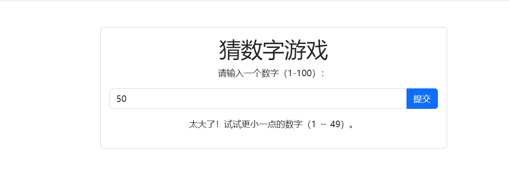

# ACK 前后端分离项目部署

### 前置条件：
#### 1，环境准备：

在开始部署前后端分离的应用程序之前，您需要先准备好以下环境：
~~~
1， 阿里云账号：在阿里云控制台创建一个账号，并拥有该账号内所需的产品权限。
2， ACK 集群：在阿里云控制台创建一个 ACK 集群，用于部署应用程序。
3， 镜像仓库：在阿里云容器镜像服务中创建一个镜像仓库，用于存储前后端分离应用程序的 Docker 镜像。
4， kubectl环境：配置kubectl环境，用于通过kubectl远程管理ACK集群并部署应用。（[参考配置通过kubectl管理ACK集群]()）
~~~
#### 2，前端应用部署：  
2.1，拉取git仓库前端应用代码并构建镜像

Demo地址：[前后端分离demo项目VUE 前端](https://github.com/Roliyal/CROlordCodelibrary/tree/main/Chapter2KubernetesApplicationBuild/Unit2CodeLibrary/FEBEseparation/vue-go-guess-number)

拉取完成后进入vue-go-guess-number目录，进行前端项目容器镜像打包：
~~~shell
docker build -t vue-nginx:v1 .
docker resource
~~~
执行结果如下：（如build失败，可通过查看build日志排查调整Dockerfile解决）  
~~~
$ docker build -t vue-nginx:v1 .
[+] Building 117.2s (17/17) FINISHED                                                                                                                                       
 => [internal] load .dockerignore                                                                                                                                     0.0s
 => => transferring context: 2B                                                                                                                                       0.0s
 => [internal] load build definition from Dockerfile                                                                                                                  0.0s
 => => transferring dockerfile: 481B                                                                                                                                  0.0s
 => [internal] load metadata for docker.io/library/nginx:1.21-alpine                                                                                                  1.6s
 => [internal] load metadata for docker.io/library/node:14-alpine                                                                                                     1.6s
 => [stage-1 1/3] FROM docker.io/library/nginx:1.21-alpine@sha256:a74534e76ee1121d418fa7394ca930eb67440deda413848bc67c68138535b989                                    0.0s
 => [internal] load build context                                                                                                                                     0.4s
 => => transferring context: 2.95MB                                                                                                                                   0.4s
 => [vue-build 1/8] FROM docker.io/library/node:14-alpine@sha256:434215b487a329c9e867202ff89e704d3a75e554822e07f3e0c0f9e606121b33                                     0.0s
 => CACHED [vue-build 2/8] WORKDIR /app                                                                                                                               0.0s
 => CACHED [vue-build 3/8] RUN npm install --production                                                                                                               0.0s
 => [vue-build 4/8] COPY .  .                                                                                                                                         2.4s
 => [vue-build 5/8] RUN pwd                                                                                                                                           0.3s
 => [vue-build 6/8] RUN npm install                                                                                                                                  60.1s
 => [vue-build 7/8] RUN npm install -g @vue/cli                                                                                                                      43.9s
 => [vue-build 8/8] RUN npm run build                                                                                                                                 8.0s 
 => CACHED [stage-1 2/3] COPY --from=vue-build /app/dist /usr/share/nginx/html                                                                                        0.0s 
 => CACHED [stage-1 3/3] COPY ./nginx.conf /etc/nginx/nginx.conf                                                                                                      0.0s 
 => exporting to image                                                                                                                                                0.0s 
 => => exporting layers                                                                                                                                               0.0s 
 => => writing image sha256:6457cf734b3ad0e3dd3060ae2c12e3fc0c51af73ca90d8376adb845a0b712b0c                                                                          0.0s 
 => => naming to docker.io/library/vue-nginx:v1                                                                                                                       0.0s   
 
$ docker images
REPOSITORY                                                  TAG            IMAGE ID       CREATED              SIZE
vue-nginx                                                   v1             c275b56da543   About a minute ago   24.4MB
~~~

镜像构建成功后，可通过Docker-slim 工具进行镜像优化（此处Demo不做演示），具体优化步骤可参考:
[鳄霸镜像优化](https://github.com/Roliyal/CROlordCloudNative/blob/main/%E7%AC%AC1%E7%AB%A0%20%E5%A7%8B%EF%BC%9A%E5%B7%A5%E5%85%B7%E9%93%BE/%E7%AC%AC2%E8%8A%82%20%E9%95%9C%E5%83%8F%E4%BC%98%E5%8C%96.md)

2.2，上传镜像至阿里云镜像仓库（ACR）
~~~shell
docker login --username=[阿里云账号全名]  [镜像仓库地址]  
docker tag [ImageId]  [镜像仓库地址]:[镜像版本号]  
docker push  [镜像仓库地址]:[镜像版本号]   
~~~

2.3，通过yaml部署前端应用  
Demo yaml参考：

~~~yaml
apiVersion: apps/v1
kind: Deployment
metadata:
  name: app-vue-front
  labels:
    app: app-vue-front
spec:
  replicas: 3
  selector:
    matchLabels:
      app: app-vue-front
  template:
    metadata:
      labels:
        app: app-vue-front
    spec:
      containers:
        - name: app-vue-front
          image: registry-vpc.cn-hongkong.aliyuncs.com/crolord_acr_personal/febe:frontv2
          ports:
            - containerPort: 80
          volumeMounts:
            - name: nginx-config
              mountPath: /etc/nginx/conf.d
      volumes:
        - name: nginx-config
          configMap:
            name: app-vue-front-nginx-config
---
apiVersion: v1
kind: Service
metadata:
  name: app-vue-front-service
spec:
  selector:
    app: app-vue-front
  ports:
    - protocol: TCP
      port: 80
      targetPort: 80
  type: ClusterIP
---
apiVersion: v1
kind: ConfigMap
metadata:
  name: app-vue-front-nginx-config
data:
  default.conf: |
    http {
        log_format custom_log_format '[$time_local] $remote_addr - $remote_user - $server_name to: $upstream_addr: $request upstream_response_time $upstream_response_time msec $msec request_time $request_time';

        access_log /var/log/nginx/access.log custom_log_format;
        error_log /var/log/nginx/error.log;
    }
~~~
执行命令创建Deployment和Service
~~~shell
kubectl apply -f vue-go-number.dingding .  
~~~  
标准输出：
~~~shell
namespace/default unchanged
deployment.apps/vue-go-number created
service/vue-go-svc created
~~~
查看新创建的Deployment和Service
~~~shell
kubectl get deployments -n default  
kubectl get svc -n default
~~~
标准输出：
~~~shell
kubectl get deployments -n default 
NAME            READY   UP-TO-DATE   AVAILABLE   AGE
vue-go-number   1/1     1            1           6m42s
~~~
~~~shell
kubectl get svc -n default
NAME         TYPE        CLUSTER-IP        EXTERNAL-IP   PORT(S)   AGE
kubernetes   ClusterIP   192.168.0.1       <none>        443/TCP   43h
vue-go-svc   ClusterIP   192.168.228.200   <none>        80/TCP    7m31s
~~~
到这里Deployment和Service已经创建完成。Service我们通过ClusterIP的方式配置，需要通过公网访问服务，还需要配置创建ingress。（关于ingress创建及选型，请参考第二节 ACK ingress选型配置）  

创建ingress  
yaml参考：  
~~~yaml
apiVersion: networking.k8s.io/v1
kind: Ingress
metadata:
  name: crolord-ingress
  namespace: default
spec:
  ingressClassName: ack-nginx
  rules:
  - host: vue.roliyal.com
    http:
      paths:
      - path: /
        backend:
          service: 
            name: vue-go-svc
            port:
              number: 80
        pathType: ImplementationSpecific
~~~
配置域名解析后，通过域名测试访问：  

#### 3.后端应用部署
3.1，拉取git仓库前端应用代码并构建镜像

Demo地址：[前后端分离demo项目Go 后端](https://github.com/Roliyal/CROlordCodelibrary/tree/main/Chapter2KubernetesApplicationBuild/Unit2CodeLibrary/FEBEseparation/go-guess-number)

拉取完成后进入go-guess-number目录，进行前端项目容器镜像打包：
~~~shell
docker build -t go-guess:v1 .
docker resource
~~~
执行结果如下：（如build失败，可通过查看build日志排查调整Dockerfile解决）

~~~ shell
$ docker build -t go-guess:v1 .
[+] Building 1.5s (15/15) FINISHED                                                                                                                                         
 => [internal] load build definition from Dockerfile                                                                                                                  0.0s
 => => transferring dockerfile: 433B                                                                                                                                  0.0s
 => [internal] load .dockerignore                                                                                                                                     0.0s
 => => transferring context: 2B                                                                                                                                       0.0s
 => [internal] load metadata for gcr.io/distroless/static:nonroot                                                                                                     0.5s
 => [internal] load metadata for docker.io/library/golang:1.17-alpine                                                                                                 1.5s
 => [stage-1 1/2] FROM gcr.io/distroless/static:nonroot@sha256:149531e38c7e4554d4a6725d7d70593ef9f9881358809463800669ac89f3b0ec                                       0.0s
 => [internal] load build context                                                                                                                                     0.0s
 => => transferring context: 80B                                                                                                                                      0.0s
 => [go-build 1/7] FROM docker.io/library/golang:1.17-alpine@sha256:99ddec1bbfd6d6bca3f9804c02363daee8c8524dae50df7942e8e60788fd17c9                                  0.0s
 => CACHED [go-build 2/7] WORKDIR /go/src/app                                                                                                                         0.0s
 => CACHED [go-build 3/7] COPY ./go.mod .                                                                                                                             0.0s
 => CACHED [go-build 4/7] COPY ./go.sum .                                                                                                                             0.0s
 => CACHED [go-build 5/7] RUN go mod download                                                                                                                         0.0s
 => CACHED [go-build 6/7] COPY ./main.go .                                                                                                                            0.0s
 => CACHED [go-build 7/7] RUN CGO_ENABLED=0 GOOS=linux go build -a -installsuffix cgo -o app .                                                                        0.0s
 => CACHED [stage-1 2/2] COPY --from=go-build /go/src/app/app /app                                                                                                    0.0s
 => exporting to image                                                                                                                                                0.0s
 => => exporting layers                                                                                                                                               0.0s
 => => writing image sha256:4e823bec709f670270902836150e35a72bc4851cd84741a68f908eae3e8284e9                                                                          0.0s
 => => naming to docker.io/library/go-guess:v1                                                                                                                        0.0s  
 
 
$ docker images
REPOSITORY                                                  TAG            IMAGE ID       CREATED        SIZE
go-guess                                                    v1             4e823bec709f   4 hours ago    9.12MB
~~~

镜像构建成功后，可通过Docker-slim 工具进行镜像优化（此处Demo不做演示），具体优化步骤可参考:
[鳄霸镜像优化](https://github.com/Roliyal/CROlordCloudNative/blob/main/%E7%AC%AC1%E7%AB%A0%20%E5%A7%8B%EF%BC%9A%E5%B7%A5%E5%85%B7%E9%93%BE/%E7%AC%AC2%E8%8A%82%20%E9%95%9C%E5%83%8F%E4%BC%98%E5%8C%96.md)

3.2，上传镜像至阿里云镜像仓库（ACR）
~~~shell
docker login --username=[阿里云账号全名]  [镜像仓库地址]  
docker tag [ImageId]  [镜像仓库地址]:[镜像版本号]  
docker push  [镜像仓库地址]:[镜像版本号]   
~~~
(同上面2.2上传镜像至阿里云镜像仓库ACR)

3.3，通过yaml部署后端应用  
Demo yaml参考：
~~~yaml
apiVersion: apps/v1
kind: Deployment
metadata:
  name: app-go-backend
spec:
  replicas: 3
  selector:
    matchLabels:
      app: app-go-backend
  template:
    metadata:
      labels:
        app: app-go-backend
    spec:
      containers:
        - name: app-go-backend
          image: registry-vpc.cn-hongkong.aliyuncs.com/crolord_acr_personal/febe:backendV2
          ports:
            - containerPort: 8081
          resources:
            limits:
              cpu: 500m
              memory: 256Mi
            requests:
              cpu: 250m
              memory: 128Mi

---
apiVersion: v1
kind: Service
metadata:
  name: app-go-backend-service
spec:
  selector:
    app: app-go-backend
  ports:
    - protocol: TCP
      port: 8081
      targetPort: 8081
  type: ClusterIP

---
apiVersion: networking.k8s.io/v1
kind: Ingress
metadata:
  name: app-go-backend-ingress
spec:
  rules:
    - host:
      http:
        paths:
          - path: /check-guess
            pathType: Prefix
            backend:
              service:
                name: app-go-backend-service
                port:
                  number: 8081
      http:
        paths:
          - path: /
            pathType: Prefix
            backend:
              service:
                name: app-vue-front-service
                port:
                  number: 80

~~~
3.4， 测试后端访问

进行猜数字游戏吧。