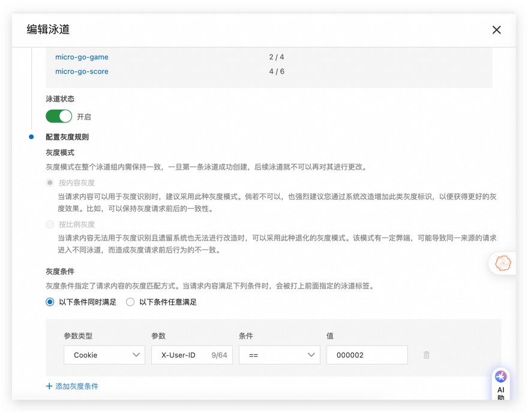
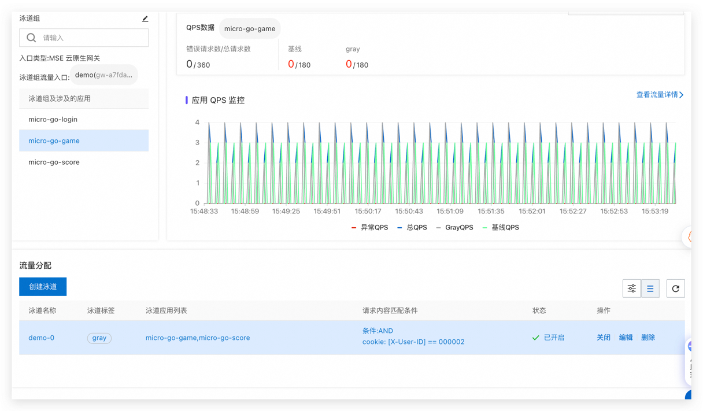

---

# 基于阿里云 MSE 实现 **Go 服务灰度发布** — 从代码到生产的全流程

> 适用场景
> - **容器化 Go 微服务**
> - 已接入 **Alibaba Cloud MSE**（微服务治理中心 + 灰度路由）
> - Docker 镜像托管在 **ACR**，CI & CD 使用 **Jenkins**
> - 目标运行环境：Kubernetes（自建或 ACK）

---

## 目录

1. [前置条件](#前置条件)
2. [准备工作](#准备工作)
    - 2.1 [为 Go 应用打上 MSE 标签](#21-为-go-应用打上mse-标签)
    - 2.2 [配置灰度路由规则](#22-配置灰度路由规则)
3. [Jenkins CI 流水线（镜像构建&推送）](#jenkinsci-流水线镜像构建推送)
4. [Jenkins CD 流水线（灰度发布）](#jenkinscd-流水线灰度发布)
5. [在 MSE 控制台观察流量](#在-mse-控制台观察流量)
6. [可选：灰度探活 / 自动扩缩](#可选灰度探活--自动扩缩)
7. [常见问题 FAQ](#常见问题-faq)

---

## 前置条件

| 组件 | 版本 / 说明 |
|------|-------------|
| **Go** | 1.20+（已内置 InstGo & ARMS Trace） |
| **MSE** | 2.0 Console，已创建 *服务治理实例* |
| **ACR** | 企业版实例（推荐） |
| **Jenkins** | 2.346+，安装 *MSE Jenkins Plug-in*<br>（同 SAE 插件安装方式，上传 `mse-jenkins-plugin.hpi`） |
| **Kubernetes/ACK** | ≥ 1.24，节点访问 MSE VPC |

---

## 准备工作

### 2.1 为所有 Go 应用打上 **MSE 标签**

1. 在代码根目录创建 `k8s/deployment.yaml`：

```yaml
···
  template:
    metadata:
      labels:
        app: micro-go-game 
        msePilotAutoEnable: "on"  # 必填，否则 MSE 无法识别
        mseNamespace: "crolord"   # 选填
        msePilotCreateAppName: "micro-go-game"  # 必填，默认为 appName
        aliyun.com/app-language: golang # 必填，否则 MSE 无法识别
···
```


2. 在 **Dockerfile** 中启用 MSE 注入 *(关键)*：

```dockerfile
# 使用官方 Golang 镜像作为基础镜像
FROM golang:1.22.4 AS builder

# 设置工作目录
WORKDIR /app

# 设置 Go 代理为阿里云镜像
ENV GOPROXY=https://mirrors.aliyun.com/goproxy/

# 下载 instgo 工具并适配架构
RUN uname -m && \
    if [ "$(uname -m)" = "x86_64" ]; then \
        wget "http://arms-apm-ap-southeast-1.oss-ap-southeast-1.aliyuncs.com/instgo/instgo-linux-amd64" -O instgo; \
    elif [ "$(uname -m)" = "aarch64" ]; then \
        wget "http://arms-apm-ap-southeast-1.oss-ap-southeast-1.aliyuncs.com/instgo/instgo-linux-arm64" -O instgo; \
    else \
        echo "Unsupported architecture"; exit 1; \
    fi && \
    chmod +x instgo

# 设置 LicenseKey 和 RegionId
RUN /app/instgo set --mse  --licenseKey=djqtzchc9t@b929339d9ac7fb0 --regionId=ap-southeast-1 --agentVersion=1.6.1

# 复制 go.mod, go.sum 文件到工作目录
COPY go.mod go.sum .env ./

RUN go mod download
# 复制源代码到工作目录
COPY . .

# 编译 AMD64 架构的二进制文件
RUN CGO_ENABLED=0 GOOS=linux GOARCH=amd64 ./instgo go build -o main-amd64 .

# 编译 ARM64 架构的二进制文件
RUN CGO_ENABLED=0 GOOS=linux GOARCH=arm64 ./instgo go build -o main-arm64 .
···
```
1. 核心在于 `instgo` 工具进行编译，GO语言本身是静态编译型需要使用`instgo`工具进行二次编译，`instgo`工具会自动注入ARMS探针。

3. **编译阶段** 产出镜像，例如
   ```
   registry.ap-southeast-1.aliyuncs.com/micro1/micro-go-game:1.0.161
   ```

### 2.2 配置灰度路由规则

1. 登录 **MSE 控制台 → 治理中心**  
   进入 *全链路灰度* → 创建泳道 服务。
2. 创建 *泳道组名称*：
    - **流量入口**：选择使用的网关类型，例如本文使用  **MSE云原生网关**
    - 
    - **配置灰度规则**：`X-user-id 条件 value`
    - 
3. 保存后生效。
   
## Jenkins CI 流水线（镜像构建&推送）

<details>
<summary>Jenkinsfile（Build Stage）</summary>

```groovy
pipeline {
  agent any
  environment {
      IMAGE_REGISTRY  = 'registry-vpc.cn-hongkong.aliyuncs.com'
      IMAGE_NAMESPACE = 'demo'
      IMAGE_NAME      = 'micro-go-game'
      VERSION_TAG     = "${env.BUILD_NUMBER}"
      FULL_IMAGE_URL  = "${IMAGE_REGISTRY}/${IMAGE_NAMESPACE}/${IMAGE_NAME}:${VERSION_TAG}"
  }
  stages {
    stage('Build & Push') {
      steps {
        container('kanikoamd') {
          sh """
            /kaniko/executor \
             --context=`pwd` \
             --destination=${FULL_IMAGE_URL} \
             --push-retry=3
          """
        }
      }
    }
  }
}
```

</details>

---

## Jenkins CD 流水线（灰度发布）

> 使用 **MSE Jenkins Plug-in** 的 `mseClient: Deploy Gray Release` 步骤  
>（示例脚本演示 10 % → 50 % → 100 % 三批自动灰度）

```groovy
pipeline {
  agent any
  parameters {
      string(name: 'MSE_CRED',       defaultValue: 'mse-cred-prod',  description: 'MSE 凭据 ID')
      string(name: 'MSE_NAMESPACE',  defaultValue: 'cn-hongkong:ns-a1b2c3', description: '命名空间 ID')
      string(name: 'SERVICE_NAME',   defaultValue: 'micro-go-game',  description: '服务名')
      string(name: 'IMAGE_URL',      defaultValue: 'registry-vpc.cn-hongkong.aliyuncs.com/demo/micro-go-game:${BUILD_NUMBER}', description: '新镜像')
      string(name: 'GRAY_TAG',       defaultValue: 'gray',           description: '灰度标签值')
      string(name: 'BATCH_PLAN',     defaultValue: '10,50,100',      description: '灰度批次百分比')
  }

  stages {
    stage('Gray Deploy') {
      steps {
        script {
          def batches = params.BATCH_PLAN.split(',')
          for (p in batches) {
            echo ">>> 灰度批次 ${p}% 开始"
            mseClient([
              deployGrayRelease(
                  credentialsId: params.MSE_CRED,
                  namespace:     params.MSE_NAMESPACE,
                  serviceName:   params.SERVICE_NAME,
                  imageUrl:      params.IMAGE_URL,
                  grayTag:       params.GRAY_TAG,
                  trafficPercent:p.toInteger()
              )
            ])
            // 可选：等待指标 & 人工 Gate
            input message: "批次 ${p}% 已发布，手动确认继续？", ok: '继续'
          }
        }
      }
    }
  }
}
```

**参数说明**

| 名称 | 解释 |
|------|------|
| `grayTag` | 与 Console 标签路由一致（例：`gray`） |
| `trafficPercent` | 当前批次灰度比例（1-100） |
| `deployGrayRelease` plug-in | 内部调用 *MSE OpenAPI /v1/grayRelease/update* |

---

## 在 MSE 控制台观察流量

1. **灰度总览**：查看实时灰度比例、实例分布
2. **监控指标**：可关联 ARMS/SLS 查看新旧版本 QPS、错误率
3. 异常时一键 *回滚* 或 *终止灰度*。

---

## 可选：灰度探活 / 自动扩缩

- **探活脚本**：在 Jenkins 灰度批次之间插入自定义脚本，调用 Prometheus 或 Grafana API 判定 SLA。
- **MSE 流量熔断**：设置熔断策略，当错误率 > 阈值 时自动熔断灰度实例。
- **KEDA + ACK**：根据灰度实例的 CPU / QPS 自动横向扩容。

---

## 常见问题 FAQ

| 现象 | 解决方案 |
|------|----------|
| *灰度标签无效，流量全量命中新版本* | 检查 Ingress / Gateway 是否透传请求头 `x-mse-tag`；或使用 Cookie / Query 方式打标。 |
| Jenkins 提示 *Unauthorized* | MSE Jenkins 凭据 Name 必须与系统配置 **Deploy to MSE** 条目一致；AK/​SK 需具备 `MseFullAccess` 策略。 |
| 灰度比例更新无效 | MSE 规则修改默认 30 s 生效；确认 `deployGrayRelease` API 返回 200。 |
| Go 服务 Trace 不上报 | 确认 InstGo 注入成功 (`OTELTOOL_USE_MSE=true`) 且开放端口 8090（默认）。 |

---

## 结束语

至此，我们完成了 **基于 MSE 的 Go 微服务灰度发布** 全流程：  
*镜像构建 → Jenkins Gray CD → MSE 灰度治理 → 指标监控/回滚*。  
你可以根据实际场景扩展蓝绿部署、A/B Test、分地域灰度等进阶功能。如有问题，欢迎在 **钉钉群 83210005055** 交流。