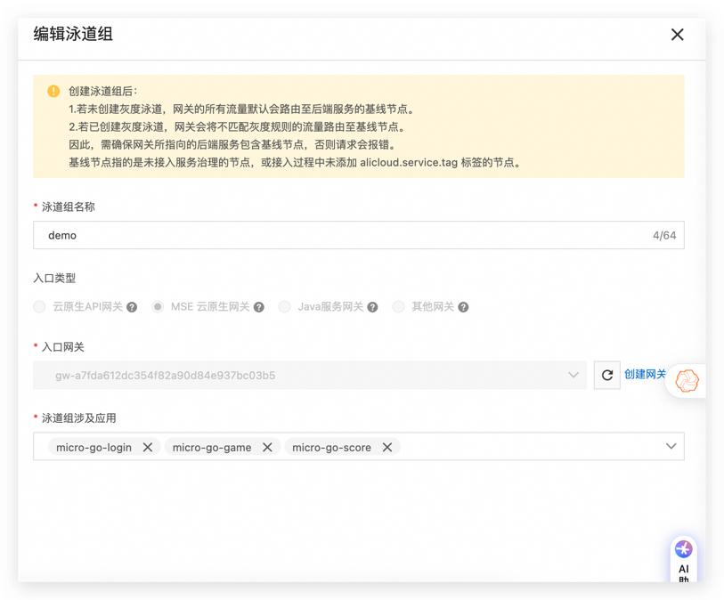
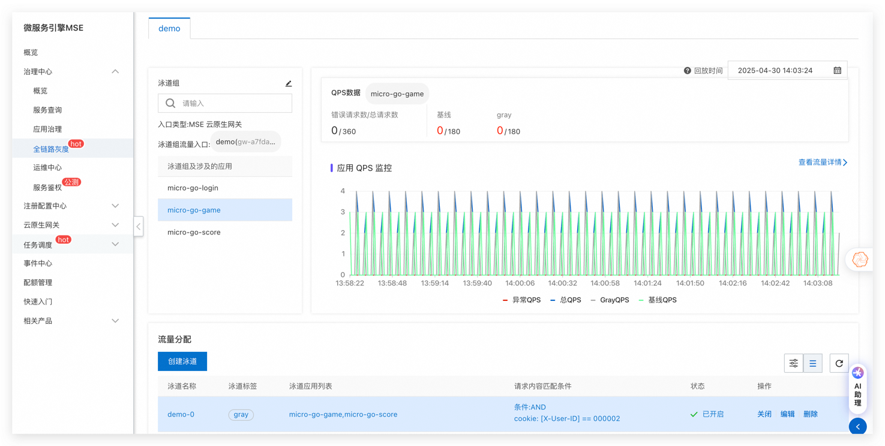

# 基于阿里云 MSE 实现 **Go 服务全链路灰度发布** — 从代码到生产的全流程

> 适用场景
> - **容器化 Go 微服务**
> - 已接入 **Alibaba Cloud MSE**（微服务治理中心 + 灰度路由）
> - Docker 镜像托管在 **ACR**，CI & CD 使用 **Jenkins**
> - 目标运行环境：Kubernetes（自建或 ACK）

## 目录

1. [前置条件](#前置条件)
2. [准备工作](#准备工作)
    - 2.1 [为 Go 应用打上 MSE 标签](#21-为-go-应用打上mse-标签)
    - 2.2 [配置灰度路由规则](#22-配置灰度路由规则)
    - 2.3 [代码中的标记](#1-关于-cookie-和请求头中的-x-user-id)
3. [Jenkins CI 流水线（镜像构建&推送&灰度版本发布）中部署至 Kubernetes 的详细解释及示例](#jenkins-ci-流水线镜像构建推送灰度版本发布中部署至-kubernetes-的详细解释及示例)
4. [在 MSE 控制台观察流量](#在-mse-控制台观察流量)
5. [可选：灰度探活 / 自动扩缩](#可选灰度探活--自动扩缩)
6. [参考文档](#参考文档)
---

## 前置条件

| 组件 | 版本 / 说明                                                                     |
|------|-----------------------------------------------------------------------------|
| **Go** | 1.20+（已内置 InstGo & ARMS Trace）                                              |
| **MSE** | 2.0 Console，已创建 *服务治理实例*                                                    |
| **ACR** | 企业版实例（推荐）                                                                   |
| **Jenkins** | 2.346+，安装 *MSE ack-onepilot *<br>（ |
| **Kubernetes/ACK** | ≥ 1.24，节点访问 MSE VPC                                                         |

---

## 准备工作

### 2.1 为所有 Go 应用打上 **MSE 标签**

1. 在每个项目代码根目录创建 `k8s/deployment.yaml`：

```yaml

  template:
    metadata:
      labels:
        app: micro-go-game 
        msePilotAutoEnable: "on"  # 必填，否则 MSE 无法识别
        mseNamespace: "crolord"   # 选填
        msePilotCreateAppName: "micro-go-game"  # 必填，默认为 appName
        aliyun.com/app-language: golang # 必填，否则 MSE 无法识别

```


2. 在 **Dockerfile** 中启用 MSE 注入 *(关键)*：

```dockerfile
# 使用官方 Golang 镜像作为基础镜像
FROM golang:1.22.4 AS builder

# 设置工作目录
WORKDIR /app

# 设置 Go 代理为阿里云镜像
ENV GOPROXY=https://mirrors.aliyun.com/goproxy/

# 下载 instgo 工具并适配架构
RUN uname -m && \
    if [ "$(uname -m)" = "x86_64" ]; then \
        wget "http://arms-apm-ap-southeast-1.oss-ap-southeast-1.aliyuncs.com/instgo/instgo-linux-amd64" -O instgo; \
    elif [ "$(uname -m)" = "aarch64" ]; then \
        wget "http://arms-apm-ap-southeast-1.oss-ap-southeast-1.aliyuncs.com/instgo/instgo-linux-arm64" -O instgo; \
    else \
        echo "Unsupported architecture"; exit 1; \
    fi && \
    chmod +x instgo

# 设置 LicenseKey 和 RegionId
RUN /app/instgo set --mse  --licenseKey=d*********8fb0 --regionId=ap-****-1 --agentVersion=1.6.1

# 复制 go.mod, go.sum 文件到工作目录
COPY go.mod go.sum .env ./

RUN go mod download
# 复制源代码到工作目录
COPY . .

# 编译 AMD64 架构的二进制文件
RUN CGO_ENABLED=0 GOOS=linux GOARCH=amd64 ./instgo go build -o main-amd64 .

# 编译 ARM64 架构的二进制文件
RUN CGO_ENABLED=0 GOOS=linux GOARCH=arm64 ./instgo go build -o main-arm64 .
···
```
1. 核心在于 `instgo` 工具进行编译，GO语言本身是静态编译型需要使用`instgo`工具进行二次编译，`instgo`工具会自动注入ARMS探针。
2. 关于 Dockerfile 中，LicenseKey 和 RegionId 需要根据实际情况进行配置，具体可参考 [ACK微服务应用接入MSE治理中心（Golang版）](https://help.aliyun.com/zh/mse/getting-started/ack-microservice-application-access-mse-governance-center-golang-version#cd821c30378gg)。

3. **编译阶段** 产出镜像，例如
   ```
   registry.ap-southeast-1.aliyuncs.com/micro1/micro-go-game:1.0.161
   ```

### 2.2 配置灰度路由规则

1. 登录 **MSE 控制台 → 治理中心**  
   进入 *全链路灰度* → 创建泳道 服务。
2. 创建 *泳道组名称*：
    - **流量入口**：选择使用的网关类型，例如本文使用  **MSE云原生网关**
    - 
    - **配置灰度规则**：`X-user-id 条件 value`
    - 
3. 保存后生效。
   

### 2.3 代码中的标记
#### 浅析 login 服务中的 `cookie` 和请求头中的 `X-User-ID` 内容及其实现逻辑，并解释其实现逻辑。如 game 与 score服务逻辑类似本文不一一展开。

在这段代码中，有涉及到解析 `cookie` 和请求头中的 `X-User-ID` 的逻辑，尤其是在 **用户认证** 和 **用户信息获取** 时，它们是关键。这里 描述了 `cookie` 在全链路灰度中解析所需要的全部内容，当然您应该更需要关注是否涉及跨域问题并需要关注跨域请求的处理。

#### 1. **关于 `cookie` 和请求头中的 `X-User-ID`**

#### **解析位置：`userHandler` 函数**
在 `userHandler` 函数中，代码实现了从请求的 `Authorization` 头和 `X-User-ID` 头中获取用户身份信息。如果请求中没有这些头，它会尝试从 cookie 中获取对应的信息。

```go
func userHandler(c *gin.Context) {
    authToken := c.GetHeader("Authorization")   // 从请求头获取 Authorization 信息
    userID := c.GetHeader("X-User-ID")          // 从请求头获取 X-User-ID 信息
    if authToken == "" {
        authToken, _ = c.Cookie("AuthToken")    // 如果请求头没有 Authorization，尝试从 Cookie 获取 AuthToken
    }
    if userID == "" {
        userID, _ = c.Cookie("X-User-ID")       // 如果请求头没有 X-User-ID，尝试从 Cookie 获取 X-User-ID
    }

    if authToken == "" || userID == "" {  // 如果缺少用户信息，返回 401 错误
        c.JSON(http.StatusUnauthorized, gin.H{"error": "missing auth"})
        return
    }

    var user User
    if err := db.Where("AuthToken = ? AND ID = ?", authToken, userID).First(&user).Error; err != nil {   // 根据 AuthToken 和 X-User-ID 查找用户
        if gorm.IsRecordNotFoundError(err) {
            c.JSON(http.StatusUnauthorized, gin.H{"error": "unauthorized"})
        } else {
            c.JSON(http.StatusInternalServerError, gin.H{"error": "db error"})
        }
        return
    }
    c.JSON(http.StatusOK, user)  // 返回用户信息
}
```

#### 2. **具体的逻辑解释**

#### **从请求头解析 `Authorization` 和 `X-User-ID`**

```go
authToken := c.GetHeader("Authorization")
userID := c.GetHeader("X-User-ID")
```
- **作用**：首先尝试从请求的 HTTP 头部获取 `Authorization` 和 `X-User-ID` 字段。
- **Authorization**：通常用于存储用户的身份令牌（如 JWT token），用于验证用户身份。
- **X-User-ID**：用于传递用户的唯一标识符（如用户 ID），该值在用户认证后存储。

#### **从 `cookie` 中解析 `AuthToken` 和 `X-User-ID`**

```go
if authToken == "" {
    authToken, _ = c.Cookie("AuthToken")
}
if userID == "" {
    userID, _ = c.Cookie("X-User-ID")
}
```
- **作用**：如果请求头没有 `Authorization` 或 `X-User-ID`，代码会尝试从客户端的 `cookie` 中获取相应的值。`AuthToken` 和 `X-User-ID` 在用户登录时设置，并存储在用户的浏览器中，通常用于会话管理。
- **Cookie**：`AuthToken` 用于存储登录时生成的用户身份令牌，`X-User-ID` 用于存储用户的 ID。

#### **验证 `AuthToken` 和 `X-User-ID`**

```go
if authToken == "" || userID == "" {
    c.JSON(http.StatusUnauthorized, gin.H{"error": "missing auth"})
    return
}
```
- **作用**：检查 `authToken` 或 `userID` 是否为空。如果都为空，则表示用户未通过身份验证，返回 401 Unauthorized 错误。

#### **根据 `AuthToken` 和 `X-User-ID` 查找用户**

```go
if err := db.Where("AuthToken = ? AND ID = ?", authToken, userID).First(&user).Error; err != nil {
    if gorm.IsRecordNotFoundError(err) {
        c.JSON(http.StatusUnauthorized, gin.H{"error": "unauthorized"})
    } else {
        c.JSON(http.StatusInternalServerError, gin.H{"error": "db error"})
    }
    return
}
```
- **作用**：通过 `AuthToken` 和 `X-User-ID` 在数据库中查找用户信息，确保该请求是合法的并且用户存在。如果用户不存在或 `AuthToken` 不匹配，则返回 `401 Unauthorized` 错误。
- **数据库查询**：使用 `gorm` 查询数据库中的用户表，确保该 `AuthToken` 和 `userID` 对应的用户存在。

#### **返回用户信息**

```go
c.JSON(http.StatusOK, user)
```
- **作用**：如果用户身份验证通过，则返回该用户的详细信息（如 `ID`、`Username`、`AuthToken` 等）。

#### 3. **代码的目的与实现**

#### **用户认证**
- 用户通过 `Authorization` 头部或 `cookie` 提供的 `AuthToken` 以及 `X-User-ID` 进行身份验证。
- 如果验证通过，返回用户的详细信息。
- 如果 `AuthToken` 和 `X-User-ID` 无效或丢失，则返回 `401 Unauthorized` 错误，提示缺少授权信息。

#### **会话管理**
- 使用 `cookie` 存储和维护 `AuthToken` 和 `X-User-ID`，实现用户会话管理。即使在请求头缺少相关信息，客户端依然可以通过 `cookie` 继续会话。

```markdown
# 解析 `cookie` 和请求头中的 `X-User-ID` 内容及其实现逻辑

## 1. 解析 `cookie` 和请求头中的 `X-User-ID`

在这段代码中，主要有两个地方涉及到解析 `cookie` 和请求头中的 `X-User-ID`：

1. **从请求头解析 `Authorization` 和 `X-User-ID`**
   ```go
   authToken := c.GetHeader("Authorization")
   userID := c.GetHeader("X-User-ID")
   ```
- 尝试从 HTTP 请求头部获取 `Authorization` 和 `X-User-ID` 字段。

2. **从 `cookie` 中解析 `AuthToken` 和 `X-User-ID`**
   ```go
   if authToken == "" {
       authToken, _ = c.Cookie("AuthToken")
   }
   if userID == "" {
       userID, _ = c.Cookie("X-User-ID")
   }
   ```
   - 如果请求头中没有找到 `Authorization` 和 `X-User-ID`，则从客户端的 `cookie` 中获取。

#### 2. 请求头和 `cookie` 的作用

- **Authorization**：存储用户的身份令牌（如 JWT），用于验证用户身份。
- **X-User-ID**：存储用户的唯一标识符，用于识别用户。
- **cookie**：存储 `AuthToken` 和 `X-User-ID`，使得用户在后续请求中能够保持会话。

#### 3. 认证和用户信息获取的逻辑与跨域中间件解析

1. **验证用户身份**
   - 如果请求头中没有 `Authorization` 或 `X-User-ID`，则尝试从 `cookie` 中获取。
   - 如果获取不到 `AuthToken` 或 `userID`，则返回 `401 Unauthorized` 错误。

2. **根据 `AuthToken` 和 `X-User-ID` 查找用户**
   - 使用 `gorm` 查询数据库，确保 `AuthToken` 和 `userID` 匹配的用户存在。如果匹配成功，则返回用户信息。

3. **返回用户信息**
   - 如果用户存在且身份验证通过，则返回用户的详细信息（如 `ID`、`Username` 和 `AuthToken` 等）。
4. **跨域中间件解析**
   - 跨域处理（CORS）逻辑、它的作用是允许跨域请求，并允许客户端访问服务器的资源。
在代码中，跨域（CORS）处理是通过 **Gin 框架的 `gin-contrib/cors`** 中间件实现的。CORS 是浏览器的安全机制，允许跨域访问资源。

```go
// ---------- CORS ----------
func corsMiddleware(c *gin.Context) {
    c.Header("Access-Control-Allow-Origin", "http://micro.roliyal.com")
    c.Header("Access-Control-Allow-Headers", "Content-Type, Authorization, X-User-ID")
    c.Header("Access-Control-Allow-Methods", "GET, POST, PUT, DELETE, OPTIONS")
    c.Header("Access-Control-Allow-Credentials", "true")
    c.Header("Access-Control-Max-Age", "100")
    if c.Request.Method == "OPTIONS" {
        c.AbortWithStatus(200)
        return
    }
    c.Next()
}
```
   - 主要配置项解释

- **Access-Control-Allow-Origin**：
   - 允许跨域的来源。在此代码中，只有 `http://micro.roliyal.com` 被允许访问该 API。

- **Access-Control-Allow-Headers**：
   - 允许的请求头字段。此例中允许 `Content-Type`、`Authorization` 和 `X-User-ID` 请求头。

- **Access-Control-Allow-Methods**：
   - 允许的请求方法。此例中允许 `GET`、`POST`、`PUT`、`DELETE` 和 `OPTIONS` 请求方法。

- **Access-Control-Allow-Credentials**：
   - 是否允许携带凭据（如 Cookies）。如果设置为 `true`，表示允许请求携带凭证。

- **Access-Control-Max-Age**：
   - 预检请求的缓存时间（单位：秒）。此配置将缓存 100 秒，不需要重复预检请求。

##### 3.2 预检请求处理

```go
if c.Request.Method == "OPTIONS" {
    c.AbortWithStatus(200)
    return
}
```

#### 4. 代码中的标记总结

通过在请求头和 `cookie` 中传递和解析 `AuthToken` 和 `X-User-ID`，本程序实现了基于 `AuthToken` 的用户认证与会话管理。若用户验证通过，系统会返回用户信息；如果身份信息缺失或无效，则拒绝访问，而在灰度体系中 Cookie 信息则作为唯一标识符。进行流量的处理。

###  Jenkins CI 流水线（镜像构建&推送&灰度版本发布）中部署至 Kubernetes 的详细解释及示例

 Jenkins Pipeline 配置，涉及将 Docker 镜像部署到 Kubernetes 中。此配置同时支持 **灰度部署**（Canary Deployment）和 **回滚部署**，并根据不同条件动态选择部署策略。

#### 1. **Pipeline 总体结构**
```groovy
steps {
    unstash 'source-code'  // 恢复上一步的代码存档
    container('kanikoamd') {  // 指定容器环境，执行部署
        script {
            withCredentials([file(credentialsId: 'k8s_token_uat', variable: 'KUBECONFIG')]) {
                env.FULL_IMAGE_URL = "${env.IMAGE_REGISTRY}/${env.IMAGE_NAMESPACE}/${env.JOB_NAME}:${env.VERSION_TAG}"
                
                // 如果选择了灰度部署
                if (params.IS_CANARY_DEPLOYMENT) {
                    echo "Starting Gray Deployment (Canary)"
                    // 复制原始 deployment.yaml 文件
                    sh """
                    cp ${env.WORKSPACE}/${params.BUILD_DIRECTORY}/k8s/deployment.yaml ${env.WORKSPACE}/${params.BUILD_DIRECTORY}/k8s/deployment-canary.yaml
                    """
                    
                    // 使用 sed 修改镜像和名称为 canary 版本
                    sh """
                    sed -i 's/name: micro-go-login/name: micro-go-login-canary/g' ${env.WORKSPACE}/${params.BUILD_DIRECTORY}/k8s/deployment-canary.yaml
                    sed -i 's|image:.*|image: ${env.FULL_IMAGE_URL}|g' ${env.WORKSPACE}/${params.BUILD_DIRECTORY}/k8s/deployment-canary.yaml
                    sed -i '/aliyun.com\\/app-language: golang/a\\
                        alicloud.service.tag: gray' ${env.WORKSPACE}/${params.BUILD_DIRECTORY}/k8s/deployment-canary.yaml
                    cat  ${env.WORKSPACE}/${params.BUILD_DIRECTORY}/k8s/deployment-canary.yaml
                    kubectl apply -f ${env.WORKSPACE}/${params.BUILD_DIRECTORY}/k8s/deployment-canary.yaml
                    """
                } else if (params.ROLLBACK_DEPLOYMENT) {
                    echo "Rolling back deployment"
                    // 执行回滚
                    sh """
                    kubectl rollout undo deployment/${env.DEPLOYMENT_NAME}
                    """
                } else {
                    echo "Deploying to Kubernetes"
                    // 普通部署：直接替换镜像地址并部署
                    sh """
                    sed -i 's|image:.*|image: ${env.FULL_IMAGE_URL}|g' ${env.WORKSPACE}/${params.BUILD_DIRECTORY}/k8s/deployment.yaml
                    kubectl apply -f ${env.WORKSPACE}/${params.BUILD_DIRECTORY}/k8s/deployment.yaml
                    """
                }
            }
        }
    }
}
```

#### 2. **步骤解释**

##### **Unstash `source-code`**
```groovy
unstash 'source-code'
```
- **作用**：从 Jenkins 的构建存档中恢复之前存储的源码。`unstash` 之前需要使用 `stash` 将文件存储在某个阶段，通常用于将文件传递到其他阶段。

##### **Container 指定运行环境**
```groovy
container('kanikoamd')
```
- **作用**：指定在 `kanikoamd` 容器中执行脚本。这是 Jenkins 中的容器化步骤，确保运行环境与构建过程一致，`kanikoamd` 是一个预配置好的容器环境。

##### **Kubernetes 配置**
```groovy
withCredentials([file(credentialsId: 'k8s_token_uat', variable: 'KUBECONFIG')])
```
- **作用**：通过凭据 `k8s_token_uat` 获取 Kubernetes 配置文件，并存储在环境变量 `KUBECONFIG` 中。凭据的 ID 是在 Jenkins 系统中预先设置好的 Kubernetes 配置文件。

##### **环境变量：`FULL_IMAGE_URL`**
```groovy
env.FULL_IMAGE_URL = "${env.IMAGE_REGISTRY}/${env.IMAGE_NAMESPACE}/${env.JOB_NAME}:${env.VERSION_TAG}"
```
- **作用**：构造 Docker 镜像的完整地址。`IMAGE_REGISTRY`、`IMAGE_NAMESPACE`、`JOB_NAME` 和 `VERSION_TAG` 是 Jenkins 中的环境变量，通过这些变量动态构造镜像的路径。

##### 3. **灰度部署 (Canary Deployment) 详解**

灰度部署允许逐步将新版本应用部署到一部分用户，降低全量部署时出现问题的风险。具体步骤如下：

##### **复制原始 `deployment.yaml`**
```groovy
sh """
cp ${env.WORKSPACE}/${params.BUILD_DIRECTORY}/k8s/deployment.yaml ${env.WORKSPACE}/${params.BUILD_DIRECTORY}/k8s/deployment-canary.yaml
"""
```
- **作用**：首先复制原始的 `deployment.yaml` 配置文件，创建一个新的 `deployment-canary.yaml` 文件，为后续的灰度部署做准备。

##### **修改镜像和名称为 Canary 版本**
```groovy
sh """
sed -i 's/name: micro-go-login/name: micro-go-login-canary/g' ${env.WORKSPACE}/${params.BUILD_DIRECTORY}/k8s/deployment-canary.yaml
sed -i 's|image:.*|image: ${env.FULL_IMAGE_URL}|g' ${env.WORKSPACE}/${params.BUILD_DIRECTORY}/k8s/deployment-canary.yaml
sed -i '/aliyun.com\\/app-language: golang/a\\
    alicloud.service.tag: gray' ${env.WORKSPACE}/${params.BUILD_DIRECTORY}/k8s/deployment-canary.yaml
"""
```
- **作用**：
   1. 使用 `sed` 修改 `deployment-canary.yaml` 文件中的应用名称，将 `micro-go-login` 修改为 `micro-go-login-canary`，区分 Canary 部署和原版本。
   2. 替换镜像地址为构建的 `FULL_IMAGE_URL`，确保部署的容器是新的版本。
   3. 在配置中增加 `alicloud.service.tag: gray`，这通常是用于标识灰度版本，并帮助进行流量分配。

##### **查看并应用 `deployment-canary.yaml`**
```groovy
cat ${env.WORKSPACE}/${params.BUILD_DIRECTORY}/k8s/deployment-canary.yaml
kubectl apply -f ${env.WORKSPACE}/${params.BUILD_DIRECTORY}/k8s/deployment-canary.yaml
```
- **作用**：首先输出 `deployment-canary.yaml` 文件的内容，以便调试检查。然后使用 `kubectl apply` 将该配置应用到 Kubernetes 集群，启动灰度部署。

##### 4. **回滚部署**

如果当前部署失败或需要回滚到之前的版本，使用以下命令：
```groovy
sh """
kubectl rollout undo deployment/${env.DEPLOYMENT_NAME}
"""
```
- **作用**：`kubectl rollout undo` 用于回滚当前部署到上一个成功的版本。`DEPLOYMENT_NAME` 是应用的名称，通常从环境变量中获取。

##### 5. **普通部署**

对于没有启用灰度部署或回滚的情况，直接执行常规部署：
```groovy
sh """
sed -i 's|image:.*|image: ${env.FULL_IMAGE_URL}|g' ${env.WORKSPACE}/${params.BUILD_DIRECTORY}/k8s/deployment.yaml
kubectl apply -f ${env.WORKSPACE}/${params.BUILD_DIRECTORY}/k8s/deployment.yaml
"""
```
- **作用**：直接替换原 `deployment.yaml` 文件中的镜像地址，然后使用 `kubectl apply` 将新版本的应用部署到 Kubernetes 集群。

##### 6. **Jenkins 灰度总结**

Jenkins Pipeline 中的部署流程根据不同参数决定部署策略：
- **灰度部署 (Canary)**：复制原部署文件，修改应用名称和镜像地址，并标记为灰度版本。
- **回滚部署**：使用 `kubectl rollout undo` 回滚到上一个稳定版本。
- **普通部署**：直接更新镜像并部署到 Kubernetes。

通过这种方式，可以实现灵活的部署策略，避免一次性全部部署导致的风险，特别是对于重要的生产环境应用。


### 参考文档

- [Kubernetes Deployment Documentation](https://kubernetes.io/docs/concepts/workloads/controllers/deployment/)
- [Jenkins Pipeline Syntax](https://www.jenkins.io/doc/book/pipeline/syntax/)
- [ACK微服务应用接入MSE治理中心（Golang版）](https://help.aliyun.com/zh/mse/getting-started/ack-microservice-application-access-mse-governance-center-golang-version)
- [基于MSE云原生网关实现全链路灰度](https://help.aliyun.com/zh/mse/user-guide/implement-an-end-to-end-canary-release-by-using-mse-cloud-native-gateways)

---


## 在 MSE 控制台观察流量

1. **灰度总览**：查看实时灰度比例、实例分布、实例流量分配

2. **监控指标**：可关联 ARMS/SLS 查看新旧版本 QPS、错误率
3. 异常时一键 *回滚* 或 *终止灰度*。

---

## 可选：灰度探活 / 自动扩缩，

- **探活脚本**：在 Jenkins 灰度批次之间插入自定义脚本，调用 Prometheus 或 Grafana API HTTP 检测等判定 SLA。
- **MSE 流量熔断**：设置熔断策略，当错误率 > 阈值 时自动熔断灰度实例。
- **KEDA + ACK**：根据灰度实例的 CPU / QPS 自动横向扩容。

---

## 结束语


至此，我们完成了 **基于 MSE 的 Go 微服务全链路灰度发布** 全流程：  
*镜像构建 → Jenkins Gray CD → MSE 灰度治理 → 指标监控/回滚*。  
你可以根据实际场景扩展蓝绿部署、A/B Test、分地域灰度等进阶功能。如有问题，欢迎在 **钉钉群 83210005055** 交流。