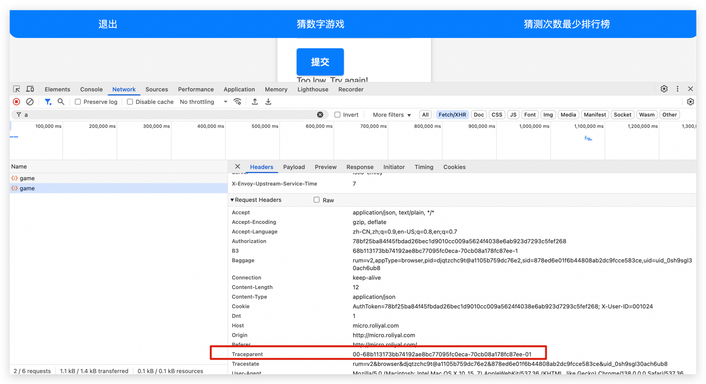
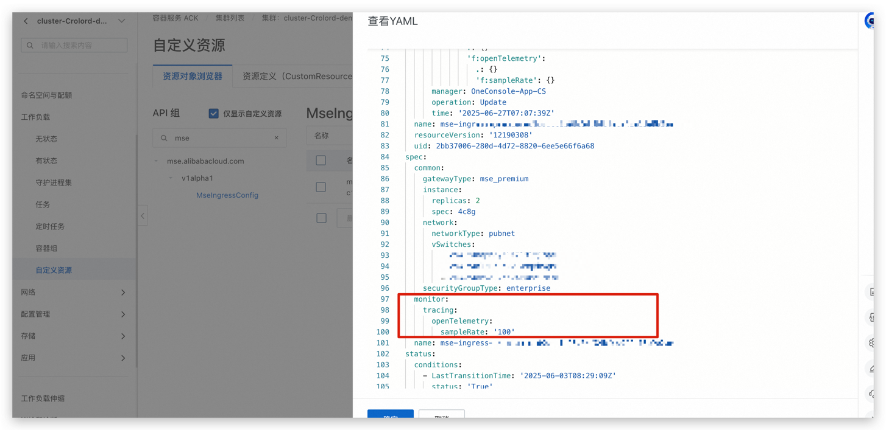
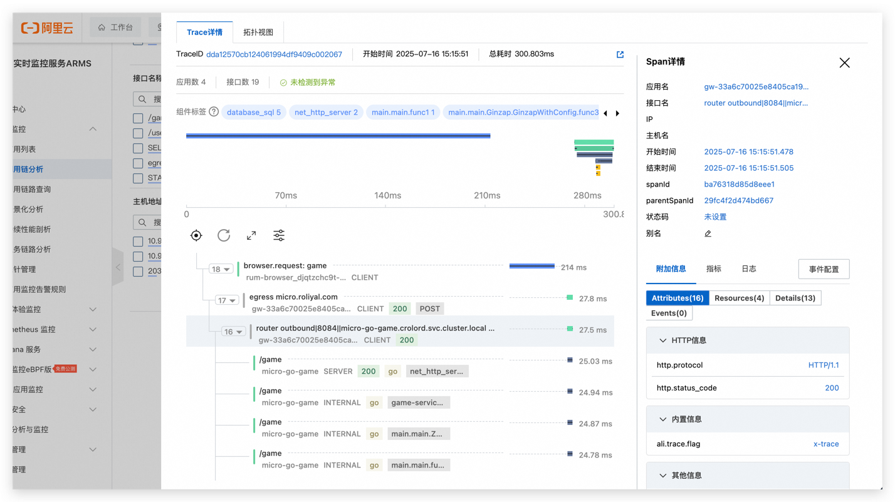

# 基于阿里云 ARMS 的端到端可观测全链路追踪实践

## 目录

1. [背景与目标](#背景与目标)
2. [术语表](#术语表)
3. [总体架构](#总体架构)
4. [前端 RUM 埋点](#前端-rum-埋点)
5. [云原生网关 MSE 透传配置](#云原生网关-mse-透传配置)
6. [后端 Go 微服务自动插桩](#后端-go-微服务自动插桩)
7. [CI/CD 灰度发布与 Trace 保护](#cicd-灰度发布与-trace-保护)
8. [采样策略与成本控制](#采样策略与成本控制)
9. [观测视角与告警](#观测视角与告警)
10. [故障排查清单](#故障排查清单)
11. [附录](#附录)
12. [参考链接](#参考链接)

---

## 背景与目标


|              | 说明                                                                                                                                                                                                                                            |
| ------------ | ----------------------------------------------------------------------------------------------------------------------------------------------------------------------------------------------------------------------------------------------- |
| **业务痛点** | · 微服务，版本发布频繁；<br>· Trace 断链导致“前端慢、后端正常”互相甩锅；<br>· 故障定位需同时翻 Nginx 日志、K8s Pod 日志、DB 慢 SQL。                                                                                                    |
| **落地目标** | 1.**Web → 网关 → 服务 → 云组件** Trace 不断链；<br>2. 灰度阶段可按版本维度查看拓扑、QPS、错误率；<br>3. Jenkins 流水线自动检测 p95 > 阈值即暂停 rollout；<br>4. 统一采样、日志-Trace 快捷互跳；<br>5. 文档一套，研发 / SRE / 测试可快速复用。 |
| **预期收益** | · 故障平均定位时长 ↓ 60 %；<br>· 版本回滚时间 ↓ 80 %；<br>· Trace 成本 ≈ QPS × 30 % × 500 Byte（可预测）。                                                                                                                              |

---

## 术语表


| 缩写      | 全称                         | 含义             |
| --------- | ---------------------------- | ---------------- |
| RUM       | Real User Monitoring         | 前端真实用户监控 |
| MSE       | Microservice Engine          | 阿里云云原生网关 |
| OTel      | OpenTelemetry                | CNCF 可观测标准  |
| Span      | Trace Span                   | 调用片段         |
| p95       | 95-th Percentile             | 95 % 分位耗时    |
| Gray 标签 | `alicloud.service.tag: gray` | 灰度实例过滤标签 |

---

## 总体架构

```mermaid
flowchart LR
  subgraph Client
    BROWSER[浏览器<br>ARMS RUM] -- traceparent --> GATEWAY
  end
  subgraph Cloud
    GATEWAY[MSE 网关<br>W3C/B3 透传] -- HTTP/gRPC --> SERVICE(Go Service<br>instgo Agent)
    SERVICE -- SQL --> RDS[(RDS MySQL)]
    SERVICE -- MQ  --> MQ[(RocketMQ)]
  end
  CLIENTLOGS((Logs))
  BROWSER -. metrics/logs .-> CLIENTLOGS
  SERVICE -. metrics/logs .-> CLOUDLOGS((Logs))
```

> **Note**
> • **协议统一**：首选 W3C Trace-Context；老系统可在 Agent 中启用 B3 兼容转译。
> • **Span 命名规范**：`<service>.<module>.<method>`，如 `payment.rpc.Pay`，便于后续 Tag 聚合检索。

---

## 前端 RUM 埋点

### 4.1 SDK 引入

### 4.2 完整配置示例 `arms.js`

```js
export const createArmsConfig = (userId) => {
    return {
        // 必填项
        pid: "djqtz*****b759dc76e2",  // 应用ID，替换为你的实际应用ID
        endpoint: "https://d*****iyuncs.com",  // 上报数据的端点，替换为你的实际上报地址

        // 可选项
        env: "prod",  // 应用环境：prod、gray、pre、daily、local（默认为prod）
        version: "1.0.0",  // 应用版本号
        user: {  // 用户信息配置
            id: "user_id",  // 用户ID，SDK默认生成，不支持更改
            //name: "user_name",            // 用户名称
            name: userId, // 用户名称可以设置为业务中的 userId
            tags: "User_Level_Demo\n",  // 用户属性演示
        },
        tracing: {
            enable: true,  // 开启链路追踪，默认关闭
            sample: 100,  // 采样率，默认100%
            tracestate: true,  // 开启tracestate透传，默认开启
            baggage: true,  // 开启baggage透传，默认关闭
            allowedUrls:[ // 配置需要透传的协议 URL ，根据实际需求选择
                {match:/.*/i, propagatorTypes:['tracecontext', 'b3']}
                //{match: 'https://micro.roliyal.com', propagatorTypes:['tracecontext', 'b3']}, // 字符匹配 https://api.aliyun.com开头，使用w3c标准
                //{match: /micro\.roliyal\.com/i, propagatorTypes:['b3multi']}, // 正则匹配包含roliyal，使用b3multi多头标准
                //{match: (url)=>url.includes('.api'), propagatorTypes:['jaeger']}, // 函数判断包含.api， 使用jaeger标准
            ]
        },
        // 上报配置
        reportConfig: {
            flushTime: 3000,
            maxEventCount: 50,
        },

        // Session 配置
        sessionConfig: {
            sampleRate: 0.5,
            maxDuration: 86400000,
            overtime: 3600000,
            storage: 'localStorage',
        },

        // 采集器配置
        collectors: {
            action: true,
            api: true,
            jsError: true,
            consoleError: true,
            perf: true,
            staticResource: true,
            webvitals: true,
        },

        // 白屏监控配置
        whiteScreen: {
            detectionRules: [{
                target: '#root',  // 目标元素的选择器
                test_when: ['LOAD', 'ERROR'],  // 触发事件：页面加载（LOAD）、发生错误（ERROR）
                delay: 5000,  // 延时5秒开始检测
                tester: 'SCREENSHOT',  // 使用截图法进行白屏检测
                configOptions: {
                    colorRange: ['rgb(255, 255, 255)'],  // 用于像素比对的颜色集合
                    threshold: 0.9,  // 白屏率阈值，大于该值认为是白屏
                    pixels: 10,  // 检测区域的像素大小
                    horizontalOffset: 210,  // 水平偏移量
                    verticalOffset: 50  // 垂直偏移量
                }
            }]
        },

        // 动态配置
        // remoteConfig: {
        //     region: "ap-southeast-1"  // 配置所在的Region，例如：ap-southeast-1、cn-hangzhou等
        // },

        // 自定义属性配置
        properties: {
            is_logged_in: true,
            ser_level: 'premium',
            app_version: "1.0.0"
        },

        // 事件过滤配置
        filters: {
            exception: [
                'Test error',  // 过滤以'Test error'开头的异常信息
                /^Script error\.?$/,  // 使用正则表达式匹配异常信息
                (msg) => msg.includes('example-error')  // 自定义过滤函数
            ],
            resource: [
                'https://example.com/',  // 过滤以'https://example.com/'开头的资源请求
                /localhost/i,  // 正则匹配localhost
                (url) => url.includes('example-resource')  // 自定义函数进行过滤
            ]
        },

        // 自定义API解析配置
        evaluateApi: async (options, response, error) => {
            let respText = '';
            if (response && response.text) {
                respText = await response.text();
            }

            const apiName = options.url.split('/').pop();  // 获取 URL 中最后一个部分，作为 API 名称

            return {
                name: apiName,  // 使用动态生成的 API 名称
                success: error ? 0 : 1,  // 请求成功状态，0表示失败，1表示成功
                snapshots: JSON.stringify({
                    params: options.params || '',  // 请求参数
                    response: respText.substring(0, 2000),  // 响应内容（截取前2000字符）
                    reqHeaders: JSON.stringify(options.headers || {}),  // 请求头
                    resHeaders: JSON.stringify(response.headers || {})  // 响应头
                }),
                properties: {
                    user_id: userId,  // 当前用户ID
                    //api_type: apiType  // API 类型（用于区分用户相关和通用API）
                }
            };
        },

        // 地理信息配置
        //geo: {
        //    country: 'your country info',  // 自定义国家信息
        //    city: 'your custom city info'  // 自定义城市信息
        //}
    };
};

```

**验证**

1. Chrome DevTools → Network → 请求头 `traceparent`。
2. ARMS → **用户体验监控** → 页面详情 → **关联 Trace**。

---

## 云原生网关 MSE 透传配置

### 5.1 控制台二步

1. **MSE 实例 → 监控与治理 → 链路追踪**
2. 勾选 **启用**，协议 **W3C**，采样率 100 %。

### 5.2 IaC 注解

```yaml
..
  monitor:
    tracing:
      openTelemetry:
        sampleRate: '100'
..
```

> **坑点**
> • 若跨域需在 CORS 插件保留 `traceparent, tracestate`。
> • 建议采样率后同后端应用保持一致采样率。

---
> 配置 MSE 网关yaml 开启链路追踪


> 配置完成

## 后端 Go 微服务自动插桩

### 6.1 Dockerfile

```dockerfile
# 使用官方 Golang 镜像作为基础镜像
FROM golang:1.22.4 AS builder

# 设置工作目录
WORKDIR /app


# 设置 Go 代理为阿里云镜像
ENV GOPROXY=https://mirrors.aliyun.com/goproxy/

# 下载 instgo 工具并适配架构
RUN uname -m && \
    if [ "$(uname -m)" = "x86_64" ]; then \
        wget "http://arms-apm-ap-southeast-1.oss-ap-southeast-1.aliyuncs.com/instgo/instgo-linux-amd64" -O instgo; \
    elif [ "$(uname -m)" = "aarch64" ]; then \
        wget "http://arms-apm-ap-southeast-1.oss-ap-southeast-1.aliyuncs.com/instgo/instgo-linux-arm64" -O instgo; \
    else \
        echo "Unsupported architecture"; exit 1; \
    fi && \
    chmod +x instgo
# 设置 LicenseKey 和 RegionId
RUN ./instgo set --agentVersion=1.6.1 //配置agentversion版本，此处为 arms 探针版本使用
RUN ./instgo set --mse  --licenseKey=djqtzchc9t@b929339d9ac7fb0 --regionId=ap-southeast-1 // 此处为 MSE 配置获取请参考mse控制台licenseKey和regionId
RUN ./instgo set   --licenseKey=djqtzchc9t@c754fcd2fcb6a7d --regionId=ap-southeast-1
# 复制 go.mod, go.sum 文件到工作目录
COPY go.mod go.sum .env ./
# 下载依赖
RUN go mod download
# 复制源代码到工作目录
COPY . .
# 编译 AMD64 架构的二进制文件
RUN CGO_ENABLED=0 GOOS=linux GOARCH=amd64 ./instgo go build -o main-amd64 .
# 编译 ARM64 架构的二进制文件
RUN CGO_ENABLED=0 GOOS=linux GOARCH=arm64 ./instgo go build -o main-arm64 .

# 使用 Alpine 镜像作为基础镜像
FROM alpine

# 安装 curl（和 ca-certificates，以支持 HTTPS）
RUN apk update && apk add --no-cache curl ca-certificates

# 添加非 root 用户
RUN addgroup -S appgroup && adduser -S appuser -G appgroup

# 设置工作目录为 /app
WORKDIR /app

# 复制编译好的 Go 二进制文件
COPY --from=builder /app/main-amd64 /app/main-amd64
COPY --from=builder /app/main-arm64 /app/main-arm64
COPY --from=builder /app/.env /app/.env
COPY --from=builder /app/start.sh /app/start.sh

# 临时切换到 root 用户来修改权限
USER root

# 赋予执行权限
RUN chmod +x /app/start.sh

# 创建日志目录并修改权限
RUN mkdir -p /app/log && chown -R appuser:appgroup /app/log

# 更改工作目录的拥有者为非 root 用户
RUN chown -R appuser:appgroup /app

# 切换回非 root 用户
USER appuser

# 暴露端口，确保与应用程序使用的端口一致
EXPOSE 8083

# 添加健康检查
HEALTHCHECK --interval=60s --timeout=5s --start-period=5s --retries=3 CMD ["/app/start.sh", "check"]

# 默认运行启动脚本
ENTRYPOINT ["/bin/sh","-c","exec /app/start.sh"]

```

> **Agent 热更新**：仅改 `--agentVersion` 即可，无需改代码。


### 6.2 日志-Trace 关联

```go
func ZapRequestLogger() gin.HandlerFunc {
  return func(c *gin.Context) {
    start := time.Now()
    c.Next()
    zapLog.Infow("HTTP",
      "status",      c.Writer.Status(),
      "method",      c.Request.Method,
      "path",        c.Request.URL.Path,
      "latency_ms",  time.Since(start).Milliseconds(),
      //"trace_id",    c.GetString("arms.trace_id"), // instgo 自动注入，可编写验证是否生效
    )
  }
}
```

---

## CI/CD 灰度发布与 Trace 保护

### 7.1 Jenkinsfile

```groovy
...
steps {
        unstash 'source-code'
        container('kanikoamd') {
            script {
                withCredentials([file(credentialsId: 'k8s_token_uat', variable: 'KUBECONFIG')]) {
                    env.FULL_IMAGE_URL = "${env.IMAGE_REGISTRY}/${env.IMAGE_NAMESPACE}/${env.JOB_NAME}:${env.VERSION_TAG}"
                    
                    if (params.IS_CANARY_DEPLOYMENT) {
                        echo "Starting Gray Deployment (Canary)"
                        // 复制 deployment.yaml 文件为 deployment-canary.yaml
                        sh """
                        cp ${env.WORKSPACE}/${params.BUILD_DIRECTORY}/k8s/deployment.yaml ${env.WORKSPACE}/${params.BUILD_DIRECTORY}/k8s/deployment-canary.yaml
                        """
                        
                        // 使用 sed 替换镜像和名称为 canary 版本
                        sh """
                        sed -i 's/name: micro-go-game/name: micro-go-game-canary/g' ${env.WORKSPACE}/${params.BUILD_DIRECTORY}/k8s/deployment-canary.yaml
                        sed -i 's|image:.*|image: ${env.FULL_IMAGE_URL}|g' ${env.WORKSPACE}/${params.BUILD_DIRECTORY}/k8s/deployment-canary.yaml
  sed -i '/aliyun.com\\/app-language: golang/a\\
        alicloud.service.tag: gray' ${env.WORKSPACE}/${params.BUILD_DIRECTORY}/k8s/deployment-canary.yaml
                        cat  ${env.WORKSPACE}/${params.BUILD_DIRECTORY}/k8s/deployment-canary.yaml
                        kubectl apply -f ${env.WORKSPACE}/${params.BUILD_DIRECTORY}/k8s/deployment-canary.yaml
                        """
                    } else if (params.ROLLBACK_DEPLOYMENT) {
                        echo "Rolling back deployment"
                        sh """
                        kubectl rollout undo deployment/${env.DEPLOYMENT_NAME}
                        """
                    } else {
                        echo "Deploying to Kubernetes"
                        // 普通部署：替换镜像地址
                        sh """
                        sed -i 's|image:.*|image: ${env.FULL_IMAGE_URL}|g' ${env.WORKSPACE}/${params.BUILD_DIRECTORY}/k8s/deployment.yaml
                        kubectl apply -f ${env.WORKSPACE}/${params.BUILD_DIRECTORY}/k8s/deployment.yaml
                        """
                    }
                }
            }
        }
    }
...    
```

---

### 8.1 层级采样矩阵


| 层级     | 采样率   | 备注                         |
| -------- | -------- | ---------------------------- |
| 浏览器   | 100 %    | 数据量小                     |
| 网关入口 | 30 %     | 可按业务调低                 |
| 服务端   | 继承网关 | instgo 自动读取              |
| 关键接口 | 条件采样 | 根据业务灵活调整，例如调整1% |

---

## 观测视角与告警


| 视角           | 控制台入口               | 常用 Filter                |
| -------------- | ------------------------ | -------------------------- |
| 调用拓扑       | ARMS 应用监控 → 拓扑    | `service.tag=gray`         |
| Trace Explorer | 可观测链路 → Trace 查询 | `trace_id=xxx` / `uid=123` |
| 慢事务         | 应用监控 → 接口分析     | Baseline vs gray           |
| RUM → Trace   | 用户体验 → 页面详情     | 一键关联                   |


## 故障排查清单


| 现象                          | 原因                        | 快速排查                                                             |
| ----------------------------- | --------------------------- | -------------------------------------------------------------------- |
| 浏览器有`traceparent`，网关无 | WAF/CDN 剥头；MSE 未透传    | `curl -H traceparent:...`；看 MSE Trace Filter，以及检查是否协议透穿 |
| Trace 断链到 DB               | gorm 版本旧                 | 检测版本是否在探针支持列表                                           |
| 日志无`trace_id`              | 未注入探针                  | 检查日志是否有探针日志相关信息                                       |
| 采样率更新慢                  | Agent 缓存/或端点未上报数据 | 建议提交工单排查                                                     |

---

## 附录

### 11.1 调用链路日志查询

```bash
 trace_id: a4067**********
```




------------------------------------------

## 参考链接


| 编号 | 说明                                                                                                                                                                |
| ---- | ------------------------------------------------------------------------------------------------------------------------------------------------------------------- |
| [1]  | [阿里云端到端链路追踪最佳实践](https://help.aliyun.com/zh/arms/application-monitoring/use-cases/alibaba-cloud-end-to-end-link-tracing-best-practices)               |
| [2]  | [如何开启 MSE 网关链路追踪](https://help.aliyun.com/zh/mse/user-guide/enable-tracing-analysis-for-a-cloud-native-gateway)                                           |
| [3]  | [Golang Agent 版本说明](https://help.aliyun.com/zh/arms/application-monitoring/user-guide/golang-agent-release-notes)                                               |
| [4]  | [Golang应用业务日志关联调用链TraceId](https://help.aliyun.com/zh/arms/application-monitoring/use-cases/associate-trace-ids-with-business-logs-for-a-go-application) |
| [5]  | [阿里云 ARMS 应用监控实践教程](https://help.aliyun.com/zh/arms/application-monitoring/use-cases)                                                                    |

---
