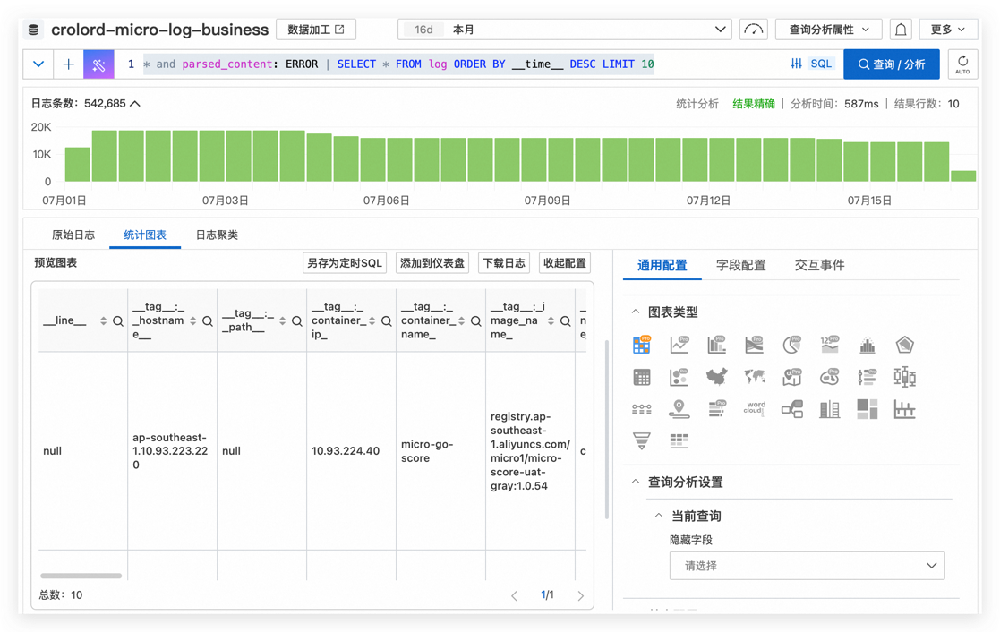
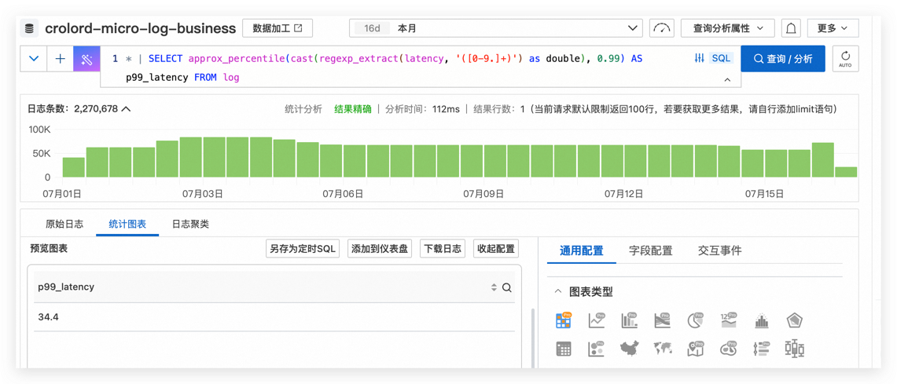
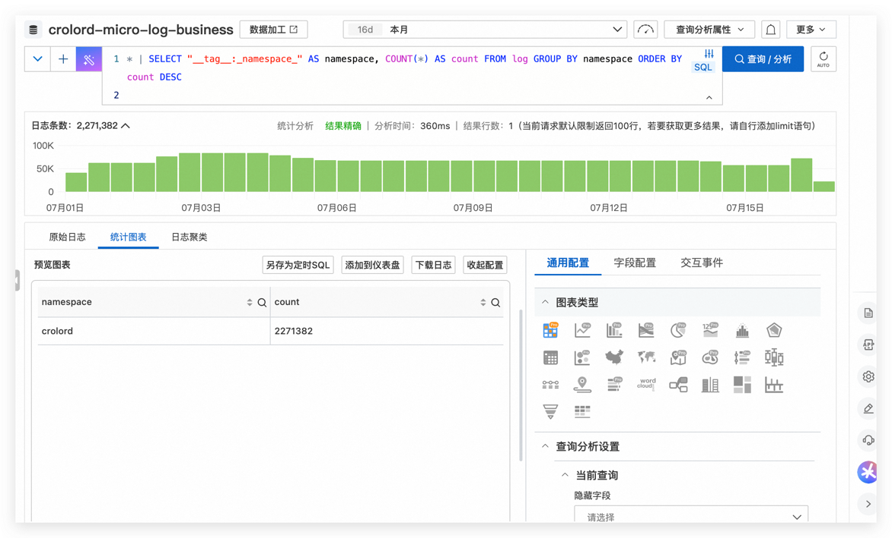
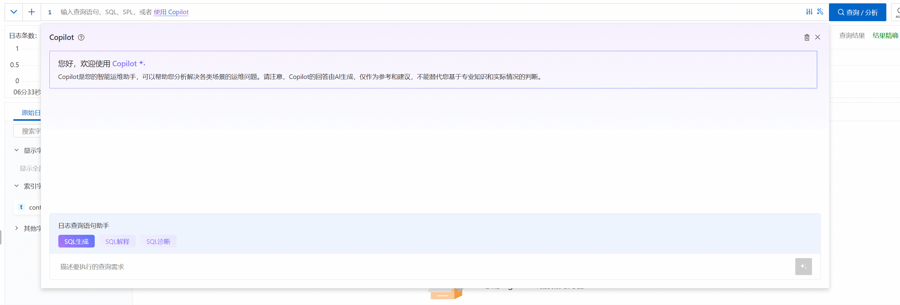

# 基于 SLS 收集 ACK 业务日志实践（LoongCollector + AliyunPipelineConfig）

> **版本**：2025‑07   
> **适用范围**：已在 ACK 集群中安装 **LoongCollector 组件**（或由 Logtail 升级而来），并希望通过 **ClusterAliyunPipelineConfig** 将容器 *Stdout/Stderr* 日志统一采集到日志服务（SLS），实现结构化解析与时间标准化。

---

## 目录
1. [背景与目标](#背景与目标)
2. [术语表](#术语表)
3. [总体流程](#总体流程)
4. [安装 LoongCollector 组件](#安装-loongcollector-组件)
5. [Project 与 Logstore 自动创建机制](#project-与-logstore-自动创建机制)
6. [AliyunPipelineConfig YAML 详解](#aliyunpipelineconfig-yaml-详解)
   1. [配置总览](#61-配置总览)
   2. [输入 `inputs`](#62-输入-inputs)
   3. [处理 `processors`](#63-处理-processors)
   4. [输出 `flushers`](#64-输出-flushers)
7. [应用配置到 ACK 集群](#应用配置到-ack-集群)
8. [查询、分析与可视化](#查询分析与可视化)
9. [日志默认字段](#日志默认字段)10
10. [参考链接](#参考链接)

---

## 背景与目标

|                      | 说明 |
| -------------------- | ------------------------------------------------------------ |
| **业务痛点**         | · 多集群多命名空间，日志格式不统一；<br>· Logtail 采集规则分散在控制台，版本不可追溯；<br>· JSON 日志需要高精度时间戳、时区校正； |
| **落地目标**         | 1. **容器 Stdout+Stderr** 无侵入采集；<br>2. 全部采集规则以 **GitOps** 方式随代码版本化；<br>3. 单 YAML 完成 JSON 解析、时间转换、毫秒级时间对齐； |
| **预期收益**         | · 环境切换（dev / prod）采集配置对齐；<br>· 解析成功率 ≥ 99%；<br>· 查询维度统一，仪表盘与告警配置复用。 |

---

## 术语表

| 缩写 / 名词            | 含义 |
| --------------------- | ---- |
| **ACK**               | Alibaba Cloud Kubernetes 托管版 |
| **SLS**               | 日志服务（Simple Log Service） |
| **LoongCollector**    | 下一代采集 Agent，兼容 Logtail DS，后续整合 eBPF / Prometheus 能力 |
| **PipelineConfig**    | SLS 2.0 采集 CRD，支持输入‑处理‑输出链路配置 |
| **Stdout/Stderr**     | 容器标准输出 / 错误输出 |
| **Processor**         | 处理插件，对日志做解析、清洗、转换 |

---

## 总体流程

```mermaid
flowchart LR
  subgraph ACK 集群
    Pod -->|Stdout+Stderr| LoongCollector
    LoongCollector -. CRD .-> KubernetesAPI
  end
  LoongCollector -- OT / HTTP --> SLS[日志服务 Project / Logstore]
  SLS --> Grafana
  SLS --> Alerts[Alert Center]
```

1. **安装 LoongCollector**：DaemonSet + ClusterRole，自动注册机器组。
2. **创建 ClusterAliyunPipelineConfig**：声明性描述输入/处理/输出。
3. **LoongCollector Operator** 解析 CRD、下发到各节点。
4. **日志写入 SLS**，再做查询、仪表盘、告警。

---

## 安装 LoongCollector 组件

1. 登录 **容器服务控制台** → **集群列表** → 目标集群。
2. 左侧 **运维管理 ▷ 组件管理**，在 **日志与监控** 页签找到 **loongcollector**，点击 **安装**。
3. 等待 `loongcollector-ds`（DaemonSet）与 `loongcollector-operator` 就绪。
4. 控制台会自动创建 `k8s-log-<cluster-id>` Project 及默认 Logstore `config-operation-log`（请勿删除）。

> **互斥说明**：`logtail-ds` 与 `loongcollector-ds` 不能共存，如已安装 Logtail，请按官方指引升级。

---

## Project 与 Logstore 自动创建机制

| 资源类型 | 命名规则 | 说明 |
| --- | --- | --- |
| **Project** | `k8s-log-<cluster-id>` | 每集群唯一，存放所有日志 Logstore |
| **机器组** | `k8s-group-<cluster-id>`<br>`k8s-group-<cluster-id>-cluster`<br>`k8s-group-<cluster-id>-singleton` | 分别对应 DS / Cluster / Singleton 采集场景 |
| **Logstore** | `config-operation-log` | 存放 LoongCollector Operator 自身日志 |

---

## AliyunPipelineConfig YAML 详解

下方示例源自实际生产环境（命名空间 **crolord**）。整体结构遵循 **输入 → 处理 → 输出** 三段式。

```yaml
apiVersion: telemetry.alibabacloud.com/v1alpha1
kind: ClusterAliyunPipelineConfig
metadata:
  name: crolord-micro-log          # 同名 CR 即配置名，集群唯一
spec:
  project:
    name: crolord-micro-log-zone   # 目标 Project，可与默认 project 不同
  logstores:
    - name: crolord-micro-log-business
  config:
    sample: ''                     # 可放示例日志，便于 UI 预览
    inputs:
      - Type: input_container_stdio
        CollectingContainersMeta: true
        IgnoringStderr: false
        IgnoringStdout: false
        Multiline:
          Mode: JSON
          UnmatchedContentTreatment: single_line
        ContainerFilters:
          K8sNamespaceRegex: ^(crolord)$
    processors:
      - Type: processor_parse_json_native
        SourceKey: content
        KeepingSourceWhenParseFail: true
        RenamedSourceKey: parsed_content
      - Type: processor_gotime
        SourceKey: ts
        SourceFormat: "2006-01-02 15:04:05"
        SourceLocation: 8
        DestKey: parsed_ts
        DestFormat: "2006/01/02 15:04:05"
        SetTime: true
        KeepSource: true
        NoKeyError: true
      - Type: processor_strptime
        SourceKey: time
        Format: "%Y-%m-%dT%H:%M:%S:%fZ"
        AdjustUTCOffset: false
        EnablePreciseTimestamp: true
        PreciseTimestampKey: precise_timestamp
        PreciseTimestampUnit: ms
        AlarmIfFail: true
        KeepSource: false
    flushers:
      - Type: flusher_sls
        Logstore: crolord-micro-log-business
        Endpoint: ap-southeast-1.log.aliyuncs.com
        Region: ap-southeast-1
        TelemetryType: logs
```

### 6.1 配置总览
(见上方代码块)

### 6.2 输入 `inputs`

| 字段 | 说明 |
| ---- | ---- |
| **Type** | `input_container_stdio`：采集容器 `stdout` / `stderr`。 |
| **Multiline.Mode** | `JSON`：自动识别 `{}` 成对日志并拼多行。 |
| **CollectingContainersMeta** | 写入 `__tag__` 容器字段，便于检索。 |
| **ContainerFilters** | 支持 **Namespace / Label / ContainerName** 多维过滤。 |

### 6.3 处理 `processors`

| Processor | 功能 | 常用选项 | 结果字段 |
| --------- | ---- | -------- | -------- |
| **processor_parse_json_native** | 将原始 `content` 解析为扁平 JSON。 | `KeepingSourceWhenParseFail` | `parsed_content.*` |
| **processor_gotime** | 用 Golang Layout 解析时间，并可改写事件时间。 | `SetTime: true`、`DestKey` | `parsed_ts` |
| **processor_strptime** | 高精度（毫秒）时间解析。 | `EnablePreciseTimestamp`、`PreciseTimestampUnit` | `precise_timestamp` |

### 6.4 输出 `flushers`

- **flusher_sls**：将处理后的日志写入目标 Logstore。
- `Endpoint`、`Region` 必须与 Project 所在地域匹配，否则写入失败。

---

## 应用配置到 ACK 集群

```bash
kubectl apply -f crolord-micro-log.yaml           # 创建 / 更新
kubectl get clusteraliyunpipelineconfig           # 查看状态
kubectl logs -l app=loongcollector-ds -n kube-system | grep 'crolord-micro-log'  # 调试
```
---

## 查询、分析与可视化

- 日志格式
```bash 
{"_time_":"2025-07-17T10:51:47.326080467+08:00","_source_":"stderr","level":"info","time":"2025-07-17T02:51:47.326Z","caller":"main.go:86","msg":"HTTP","status":"200","method":"GET","path":"/health","latency":"20.263µs","size":"15","ip":"10.93.223.220","trace_id":"","__pack_meta__":"1|MTc1MDA5ODExODQ5MTQ2MjE0Ng==|2|1","__topic__":"","__source__":"10.93.223.220","__tag__:__pack_id__":"C75A3741BE484C01-14F","__tag__:__hostname__":"ap-southeast-1.10.93.223.220","__tag__:__user_defined_id__":"k8s-group-c1d0dcc1b98c54f84bfed942a13e9b2ae","__tag__:_cluster_id_":"c1d0dcc1b98c54f84bfed942a13e9b2ae","__tag__:_container_ip_":"10.93.224.18","__tag__:_container_name_":"micro-go-game","__tag__:_image_name_":"registry.ap-southeast-1.aliyuncs.com/micro1/micro-game-uat-gray:1.0.114","__tag__:_namespace_":"crolord","__tag__:_node_ip_":"10.93.223.220","__tag__:_node_name_":"ap-southeast-1.10.93.223.220","__tag__:_pod_name_":"micro-go-game-69c5d46b47-dfrl7","__tag__:_pod_uid_":"b636a0c4-b581-45ca-a931-d259d7f466f3","__tag__:__receive_time__":"1752720708","__time__":"1752720707"}
```
- **最新错误行 Top10**  
  Query: `* and parsed_content: ERROR | SELECT * FROM log ORDER BY __time__ DESC LIMIT 10`

- **P99 Latency**  
  Query: `* | SELECT approx_percentile(cast(regexp_extract(latency, '([0-9.]+)') as double), 0.99) AS p99_latency FROM log`
- 使用regexp_extract函数提取latency中的数字部分
  将提取后的数字转换为DOUBLE类型
  此修复确保能正确处理带时间单位的字符串

- ** 如何查Namespace **  
  Query: `* | SELECT "__tag__:_namespace_" AS namespace, COUNT(*) AS count FROM log GROUP BY namespace ORDER BY count DESC`
- 使用用户预设的查询条件* and __tag__:_namespace_: crolord作为基础
  从日志中提取所有不同的namespace标签值
  统计每个namespace下的日志数量
  按数量降序排列结果


- 可在 SLS 控制台 **可视化** 页签快速拖拽生成柱状图 / 折线图，或通过 **Grafana SLS 数据源**进行复用，如不太熟练则强烈建议[使用copilot编写查询语句](https://help.aliyun.com/zh/sls/copilot-automatic-generation-of-ai-assisted-sql-statements)

---


## 参考链接

| 编号 | 说明                                                                                                                                                                                                       |
| --- |----------------------------------------------------------------------------------------------------------------------------------------------------------------------------------------------------------|
| [1] | [官方文档：使用 DaemonSet 部署 Logtail 采集文本日志](https://help.aliyun.com/zh/ack/ack-managed-and-ack-dedicated/user-guide/collect-text-logs-from-ack-clusters-using-daemonset-deployed-logtail-agents#7067b8866a2km) |
| [2] | [使用AliyunPipelineConfig管理采集配置](https://help.aliyun.com/zh/sls/recommend-use-aliyunpipelineconfig-to-manage-collection-configurations)                                                                    |
| [3] | [Logtail最佳实践](https://help.aliyun.com/zh/sls/best-practices-for-logtail)                                                                                                                                 |
| [4] | [CRD 采集配置生成器指引](https://help.aliyun.com/zh/sls/collection-configuration-generator)                                                                                                                           |
| [5] | [CRD 采集配置生成器地址](https://sls.console.aliyun.com/lognext/crd-generator)                                                                                                                                    |

