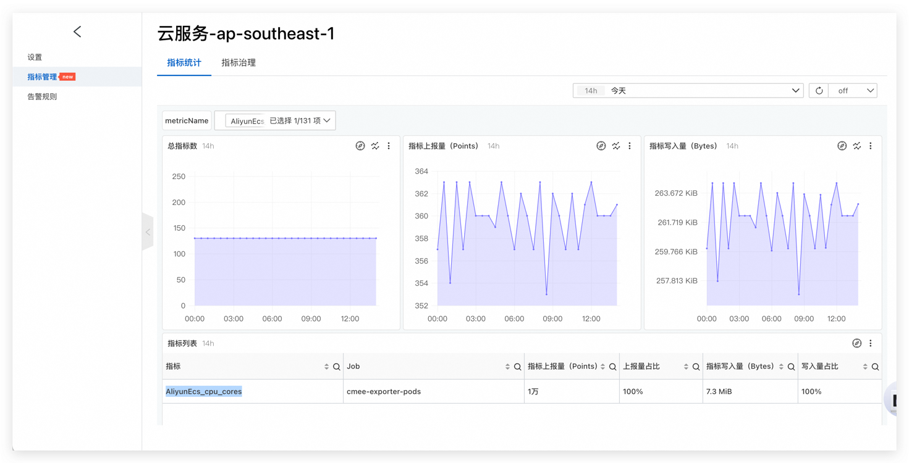

##  目录
1. 项目背景与目标
2. 整体架构设计（Mermaid 图）
3. 前置准备（账号 / 权限 / 网络 / 环境）
4. 数据接入详解  
   4.1 应用数据接入（ARMS 探针）  
   4.2 云监控数据接入（ECS / RDS / SLB 等）  
   4.3 SLS 日志数据转指标接入
5. Grafana 可视化配置  
   5.1 内置大盘效果  
   5.2 自定义仪表盘设计（PromQL 示例）
6. 验证步骤与截图示例
7. 效果展示示例
8. 参考链接与资料

---

## 项目背景与目标

统一基于阿里云云上产品（应用 → Prometheus → Grafana）实现：
- 多数据源观测（应用、云服务、日志）
- 异常统一告警，快速可视化定位
- 降低 O&M 成本，提升稳定性与可观测性能力

---

## 整体架构设计（Mermaid）

```mermaid
flowchart TD
    subgraph 应用侧
        A1[前端 H5 /web / 移动端 / 小程序]
        A2[后端 Java / Node / Python]
        A2 --> |OTel / SDK Exporter| P1
    end
    subgraph 监控平台
        P1[Prometheus 实例]
        SLS[SLS 日志库 + MetricStore]
        云监控[企业云监控（ECS / RDS ）]
    end
    A1 --> SLS
    A2 --> SLS
    云监控 --> P1
    SLS --> P1
    P1 --> Grafana[Grafana Workspace]
    Grafana --> Panel1[资源监控大盘]
    Grafana --> Panel2[应用观测大盘]
    Grafana --> Panel3[日志统计大盘]
```

---

## 前置准备（账号 / 权限 / 网络 / 环境）

| 项目            | 要求                                  |
| ------------- |-------------------------------------|
| 账号权限          | RAM 子账号，ARMS / 云监控 / SLS 权限开通       |
| Prometheus 实例 | 已开通阿里云可观测监控 Prometheus 版            |
| 企业云监控 / SLS   | 均已开通，日志库具备 MetricStore 能力           |
| 网络安全组         | 放通 9100 / 9256 端口供 node-exporter 使用 |
| Grafana       | 默认专家版，无需单独部署          |
| 监控场景明确        | 应用 → 指标 / 日志 / 云产品状态全链路             |

---

##  数据接入详解

### 4.1 应用数据接入（Golang ARMS Agent 示例）

#### **示例 Dockerfile**

```Dockerfile
# 使用官方 Golang 镜像作为基础镜像
FROM golang:1.22.4 AS builder

# 设置工作目录
WORKDIR /app

# 设置 Go 代理为阿里云镜像
ENV GOPROXY=https://mirrors.aliyun.com/goproxy/

# 下载 instgo 工具并适配架构
RUN uname -m && \
    if [ "$(uname -m)" = "x86_64" ]; then \
        wget "http://arms-apm-ap-southeast-1.oss-ap-southeast-1.aliyuncs.com/instgo/instgo-linux-amd64" -O instgo; \
    elif [ "$(uname -m)" = "aarch64" ]; then \
        wget "http://arms-apm-ap-southeast-1.oss-ap-southeast-1.aliyuncs.com/instgo/instgo-linux-arm64" -O instgo; \
    else \
        echo "Unsupported architecture"; exit 1; \
    fi && \
    chmod +x instgo

# 设置 LicenseKey 和 RegionId
RUN /app/instgo set --mse --licenseKey=djqtzchc9t@b929339d9ac7fb0 --regionId=ap-southeast-1 --agentVersion=1.6.1

# 复制 go.mod, go.sum 文件到工作目录
COPY go.mod go.sum .env ./

RUN go mod download

# 复制源代码到工作目录
COPY . .

# 编译 AMD64 架构的二进制文件
RUN CGO_ENABLED=0 GOOS=linux GOARCH=amd64 ./instgo go build -o main-amd64 .

# 编译 ARM64 架构的二进制文件
RUN CGO_ENABLED=0 GOOS=linux GOARCH=arm64 ./instgo go build -o main-arm64 .
```

#### **最终镜像构建**

```Dockerfile
FROM alpine

RUN apk update && apk add --no-cache curl ca-certificates

RUN addgroup -S appgroup && adduser -S appuser -G appgroup

WORKDIR /app

COPY --from=builder /app/main-amd64 /app/main-amd64
COPY --from=builder /app/main-arm64 /app/main-arm64
COPY --from=builder /app/.env /app/.env
COPY --from=builder /app/start.sh /app/start.sh

USER root

RUN chmod +x /app/start.sh
RUN mkdir -p /app/log && chown -R appuser:appgroup /app/log
RUN chown -R appuser:appgroup /app

USER appuser

EXPOSE 8084

HEALTHCHECK --interval=60s --timeout=5s --start-period=5s --retries=3 CMD ["/app/start.sh", "check"]

ENTRYPOINT ["/bin/sh","-c","exec /app/start.sh"]
```

#### **验证**
```bash
docker build -t myapp-arm-agent .
docker run --rm -p 8084:8084 myapp-arm-agent
```

查看 ARMS APM 控制台监控数据或日志。

```md
![ARMS 接入效果验证]
```

---

### 4.2 云监控数据接入（ECS / RDS）

* ARMS 控制台 → 接入中心 → 选择对应云产品（ECS、RDS…）
* 自动化接入企业云监控 → 会自动创建对应云服务 Prometheus 实例
* 核心指标：

    * `AliyunEcs_cpu_total`
    * `AliyunRds_MemoryUsage`
    * `AliyunSlb_connections`
> 例如 云产品监控指标 ，均可参考文档 [附录1 云产品监控指标](https://help.aliyun.com/zh/cms/cloudmonitor-1-0/support/appendix-1-metrics)

---


### 4.3 SLS 日志数据转指标（Logstore → MetricStore）

#### **场景背景**

通过 e_to_metric 数据加工函数将日志中的数值字段（如 request_time）转为指标，供 Grafana / Prometheus 使用。

---

#### **操作步骤**

##### **创建时序库（MetricStore）**

> 1. 登录 [日志服务控制台](https://sls.console.aliyun.com/)  
> 2. 进入 **目标 Project > 时序存储 > 时序库**  
> 3. 新建 **MetricStore**，如 `service-metric`

| 配置项     | 示例值  |
|--------|------|
| 名称     | `service-metric` |
| 数据保存 | 30 天    |
| Shard   | 1 或根据需求调整 |

---

##### ** 创建数据加工任务（e_to_metric 函数）**

> 1.控制台 → **数据加工**
> 2.编辑数据加工 SQL：

```sql
e_to_metric(
    names=[("request_time", "RequestTime"), ("upstream_response_time", "ResponseTime")],
    labels=[("host", "hostname")]
)
```

3. 示例加工结果：

```json
{
  "RequestTime": 71,
  "ResponseTime": 0.66,
  "hostname": "www.example.com"
}
```

4. 保存任务 → 存储目标为 `service-metric`

---

##### ** 查询指标（PromQL 或控制台）**

```sql
avg_over_time(RequestTime[5m])
avg_over_time(ResponseTime[5m])
```

```md

```

---

#### **注意事项**
- 建议使用 Tags 标识 app / env / host
- MetricStore 数据可对接 Grafana / Prometheus

---

#### **Prometheus 数据源自动接入（云产品统一入口）**

1. 登录 [阿里云 Prometheus 控制台](https://prom.console.aliyun.com/)  
2. 左侧菜单 → **数据接入 > 云产品监控**  
3. 添加 **日志服务 SLS（MetricStore）** 数据源  
4.  自动生成数据源名称：
```
实例名称/实例Id
```

> Prometheus 自动采集该 Project 下所有 MetricStore 数据，Label 自动映射。

---

#### **效果验证**

1. Grafana 添加数据源 → 选择 Prometheus（阿里云）  
2. 选择数据源 `prom-xxx`  
3. PromQL 查询示例：

```promeql
cpu{namespace="default"}
```

```
[grafana-ns.png](../resource/images/grafana-ns.png)
```

---

#### **注意事项**

| 场景               | 推荐操作            |
|------------------|------------------|
| 同 Region 内数据接入   | 使用阿里云自动数据源 |
| 跨 Region 数据看板 | 多数据源聚合接入   |
| 自建 Grafana      | 可用 API 或手动地址配置 |

---
---

## 5 Grafana 可视化配置

### 5.1 内置官方大盘效果

| 场景   | 默认大盘名称                    |
| ---- | ------------------------- |
| ECS  | ECS Overview / ECS Detail |
| GPU  | GPU Overview / GPU Detail |
| Node | Node Process              |

---

### 5.2 自定义仪表盘设计（PromQL 示例）

**ECS 主机总览（CPU / Memory / Connection）**

```sql
avg(AliyunEcs_cpu_total{}) by (regionId,instanceId,instanceName)
avg(AliyunEcs_memory_usedutilization{}) by (regionId,instanceId,instanceName)
avg(AliyunEcs_net_tcpconnection{state="ESTABLISHED"}) by (regionId,instanceId,instanceName)
```

**RDS 数据库健康**

```sql
avg(AliyunRds_CpuUsage{engine="MySQL"}) by (regionId,instanceId)
avg(AliyunRds_MemoryUsage{engine="MySQL"}) by (regionId,instanceId)
avg(AliyunRds_DiskUsage{engine="MySQL"}) by (regionId,instanceId)
```

**用户体验监控访问日志（状态错误统计）**

```sql
sum by (resourceName, resourceStatusCode) (
  increase(resource_duration_count{appEnv="prod"}[$__range])
)```

**仪表盘样例效果：**

```md

```

---

## 6 . 建议步骤

| 验证目标    | 操作方式           | 预期效果            |
| ------- | -------------- | --------------- |
| 应用指标    | curl /metrics  | Prometheus 成功采集 |
| 云监控数据   | 控制台接入检查        | Prometheus 成功采集 |
| SLS 指标  | MetricStore 确认 | Prometheus 成功采集 |
| Grafana | 可视化检查          | 多数据源大盘可见        |

---

## 8️⃣ 参考链接与资料

| 名称                                             | 地址                                                                                                          |
|------------------------------------------------| ----------------------------------------------------------------------------------------------------------- |
| 阿里云可观测编写案例                                     | [https://sls.aliyun.com/doc/](https://sls.aliyun.com/doc/) |
| 将Logstore中的日志字段转换MetricStore中的度量指标             | [https://help.aliyun.com/zh/sls/convert-logs-to-metrics](https://help.aliyun.com/zh/sls/convert-logs-to-metrics)                                                      |
| Grafana 官方文档                                   | [https://grafana.com/docs/grafana/latest/](https://grafana.com/docs/grafana/latest/)                        |
| SLS查询语法与功能| [https://help.aliyun.com/document_detail/29060.html](https://help.aliyun.com/document_detail/29060.html)   |
| 容器服务 ACK 和容器计算服务 ACS 通过 ack-onepilot 组件安装 Go 探针 | [https://help.aliyun.com/zh/arms/application-monitoring/user-guide/install-arms-agent-for-golang-applications-deployed-in-ack-and-acs]
    