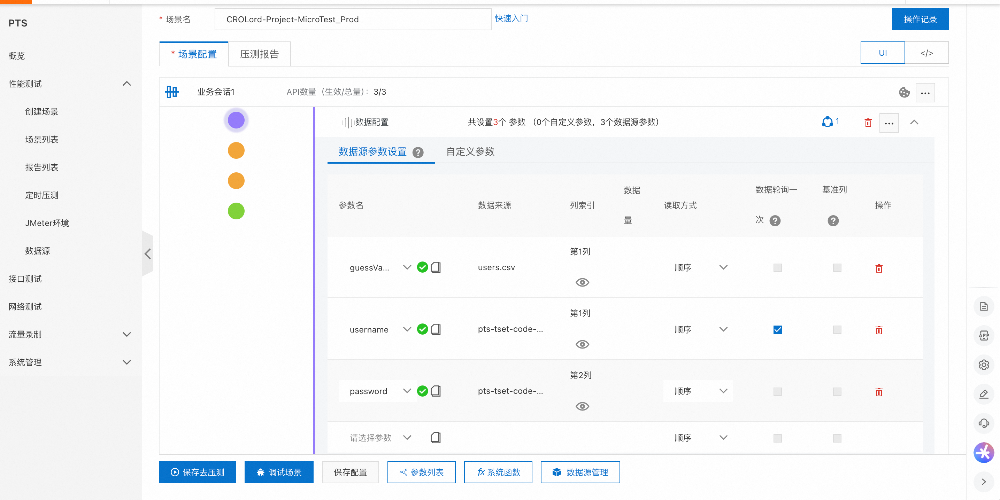
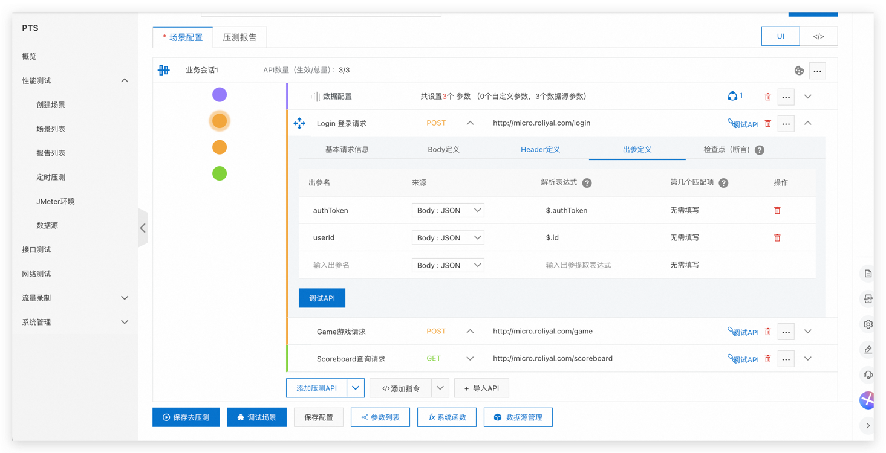
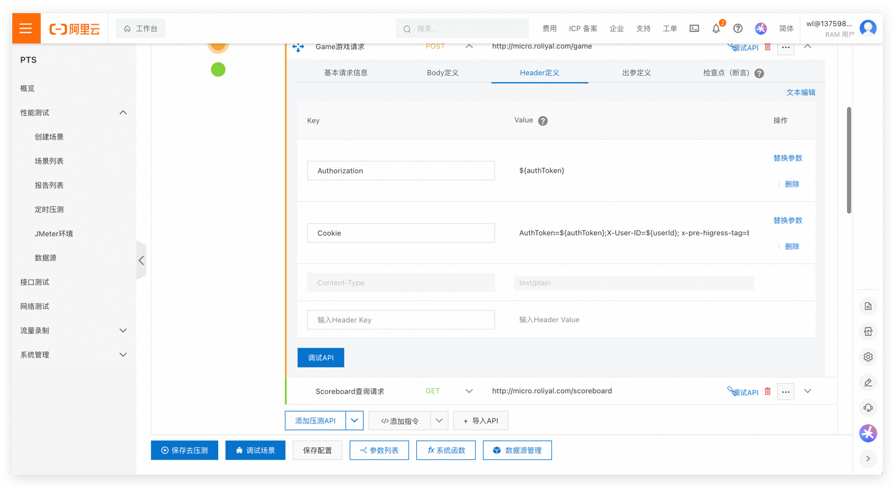
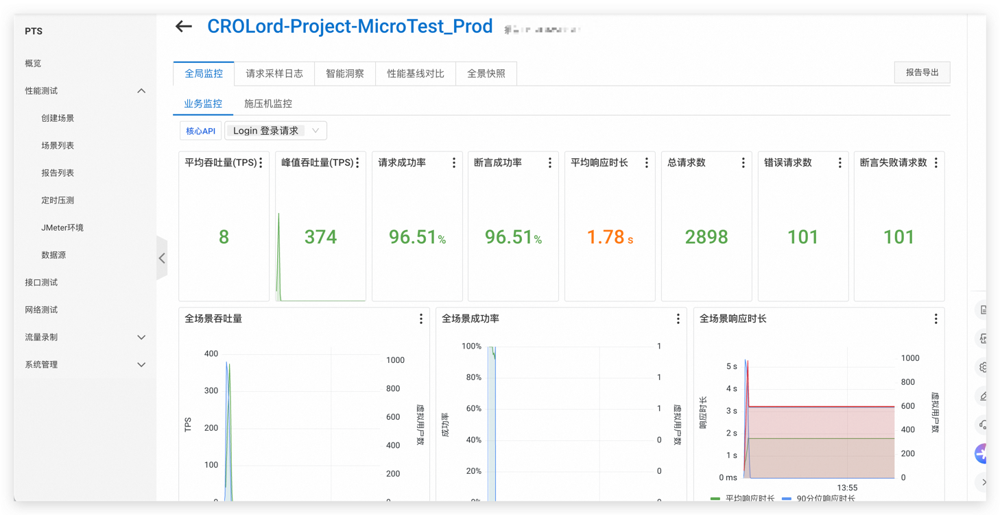

#  基于阿里云 PTS 压测场景（登录 + 游戏操作 + 查询积分）

##  目录
1. 项目背景与目标
2. 压测流程架构设计（Mermaid 图）
3. 前置准备（数据 / 参数 / 文件）
4. 测试链路详细配置  
   4.1 数据初始化节点（CSV 参数注入）  
   4.2 登录接口链路（authToken / userId 获取）  
   4.3 游戏操作接口链路（携带鉴权）  
   4.4 查询积分接口链路（鉴权验证）
5. 验证步骤与预期结果
6. 效果展示示例（可视化截图）
7. 参考资料

---

## 1. 项目背景与目标

本次压测旨在还原核心业务真实链路，检验以下能力：
- 登录鉴权能力（频繁登录、并发冲突）
- 游戏交互能力（随机输入场景模拟）
- 查询能力（排行榜、积分榜稳定性）
- 业务链路整体可用性、稳定性、性能瓶颈排查

目标效果：
- 获取链路耗时、响应率、并发极限、瓶颈接口定位
- 验证用户体验真实业务访问路径在高并发下是否稳定

---

## 2. 压测流程架构设计（Mermaid）

```mermaid
flowchart TD
    A[数据初始化 CSV 参数注入] --> B[登录接口 - 获取 Token / userId]
    B --> C[游戏接口 - 提交随机 guessValue]
    C --> D[积分查询接口 - 获取排行榜数据]
```

---

## 3. 前置准备（数据 / 参数 / 文件）

| 数据用途 | 文件名                        | 字段名      | 使用策略   | 说明                  |
|------|---------------------------|---------|--------|---------------------|
| 登录用户 | pts-code-userpass.csv | username | **一次性取用** | username 每个压测线程唯一 |
| 用户密码 | pts-code-userpass.csv  | password | **顺序循环** | password 重复使用     |
| 游戏参数 | users.csv                 | guessValue | **顺序循环** | 模拟不同用户输入随机值   |

> **注意事项：**  
> 1. username 账号仅一次性使用，避免污染数据  
> 2. guessValue 顺序轮询模拟业务输入场景  
> 3. password 可重复利用模拟弱口令等常见情况

---

## 3. 测试链路详细配置

---

### 4.1 数据初始化节点（CSV 参数注入）

**节点作用：**
- 为后续请求准备必要业务数据。
- 使用阿里云 PTS **数据初始化节点（DATA_INIT）**功能。

| 字段        | 来源文件                         | 是否唯一 | 说明         |
|-----------|----------------------------|------|------------|
| username  | pts-tset-code-userpass.csv | 是   | 登录用户名    |
| password  | pts-tset-code-userpass.csv | 否   | 登录密码    |
| guessValue | users.csv                  | 否   | 游戏输入随机值 |

**参数注入策略：**
```yaml
username: 使用一次（useOnce: true）
password: 顺序使用（useOnce: false）
guessValue: 顺序使用（useOnce: false）
```

---

### 4.2 登录接口链路（authToken / userId 获取）

| 配置项   | 说明             |
|------|----------------|
| URL  | `http://micro.roliyal.com/login` |
| 方法  | POST           |
| Header | Content-Type: application/json |
| Body | 动态参数注入 username / password |

**请求 Body 示例：**
```json
{
  "username": "${username}",
  "password": "${password}"
}
```

**返回数据提取：**
| 参数名    | 提取路径     | 用途        |
|--------|---------|-----------|
| authToken | $.authToken | 后续鉴权使用   |
| userId    | $.id      | 绑定 Cookie |

**检查点设置：**
- 响应必须包含 `authToken`
- 响应 HTTP 状态码为 200

---

### 4.3 游戏操作接口链路（携带鉴权）

| 配置项   | 说明                      |
|------|-------------------------|
| URL  | `http://micro.roliyal.com/game` |
| 方法  | POST                    |
| Headers | Authorization / Cookie（动态注入） |
| Content-Type | text/plain               |

**Headers 示例：**
```http
Authorization: ${authToken}
Cookie: AuthToken=${authToken}; X-User-ID=${userId}; x-pre-higress-tag=base
```

**请求 Body 示例：**
```json
{
  "guess": "${guessValue}"
}
```

**检查点设置：**
- 响应 body 包含关键字段 `"message"`
- HTTP 状态码为 200

---

### 4.4 查询积分接口链路（鉴权验证）

| 配置项   | 说明                     |
|------|------------------------|
| URL  | `http://micro.roliyal.com/scoreboard` |
| 方法  | GET                     |
| Header | 无特定要求               |
| 最大重定向次数 | 10                     |

**检查点设置：**
- HTTP 状态码为 200

---

## 5. 验证步骤与预期结果

| 验证目标       | 操作描述                                  | 预期结果                  |
|-----------|---------------------------------------|------------------------|
| 参数注入成功     | username / password / guessValue 正确注入 | 各请求可正确读取数据源 |
| 登录链路       | 登录请求成功，返回 token / userId              | 返回 JSON 含 authToken / userId |
| 游戏链路       | 请求带 token，参数 guessValue 合法            | 返回 200 且包含 message 字段 |
| 积分查询链路    | 请求正常，返回排行榜数据                          | HTTP 状态码 200，无错误响应 |

---

## 6. 效果展示示例（可视化截图）

### 7. 关键观测数据
- 每阶段 QPS / RT / 错误率
- 登录 / 游戏 / 查询响应耗时趋势
- 错误码分布
- 并发瓶颈观察点（TPS 饱和）

> 7.1 压测参数示意





> 7.2 压测脚本参考 
```yaml
---
Relations:
- Disabled: false
  Id: "NI61L"
  Name: "业务会话1"
  Nodes:
  - Config:
      definitions: {}
      nodeType: "DATA_INIT"
      references:
      - accessMethod: "IN_ORDER"
        asBase: false
        column: "guessValue"
        fileKey: "0d352cf1fb641785ff0a2b94e30e4577"
        fileName: "users.csv"
        index: 1
        useOnce: false
      - accessMethod: "IN_ORDER"
        asBase: false
        column: "username"
        fileKey: "ac74515b274c4d9152b4a6b0555f211f"
        fileName: "pts-tset-code-userpass.csv"
        index: 1
        useOnce: true
      - accessMethod: "IN_ORDER"
        asBase: false
        column: "password"
        fileKey: "ac74515b274c4d9152b4a6b0555f211f"
        fileName: "pts-tset-code-userpass.csv"
        index: 2
        useOnce: false
    Name: "数据配置"
    NodeId: "1WS0L"
    NodeType: "dataInit"
    pressureNode: false
  - Config:
      accessId: "RL86L"
      beginStep: 1000
      body:
        contentType: "application/json"
        value: "{\n  \"username\": \"${username}\",\n  \"password\": \"${password}\"\
          \n}\n"
      checkPoints:
      - checkers:
        - expectValue: ""
          operator: "exist"
        point: "authToken"
        type: "EXPORTED_PARAM"
      endStep: 1000
      headers:
      - name: "Content-Type"
        value: "application/json"
      method: "POST"
      nodeType: "CHAIN"
      postActions:
      - params:
        - name: "authToken"
          type: "BODY_JSON"
          value: "$.authToken"
        - name: "userId"
          type: "BODY_JSON"
          value: "$.id"
        type: "export"
      protocol: "http"
      redirectCountLimit: 0
      url: "http://micro.roliyal.com/login"
    Name: "Login 登录请求"
    NodeId: "4ZU5L"
    NodeType: "chain"
    pressureNode: true
  - Config:
      accessId: "UPABL"
      beginStep: 1000
      body:
        contentType: "text/plain"
        value: "{\n  \"guess\": ${guessValue}\n}\n"
      checkPoints:
      - checkers:
        - expectValue: "message"
          operator: "ctn"
        point: "整个body"
        type: "BODY_TEXT"
      endStep: 1000
      headers:
      - name: "Authorization"
        type: 1
        value: "${authToken}"
      - name: "Cookie"
        type: 2
        value: "AuthToken=${authToken};X-User-ID=${userId}; x-pre-higress-tag=base"
      - name: "Content-Type"
        value: "text/plain"
      method: "POST"
      nodeType: "CHAIN"
      postActions: []
      protocol: "http"
      redirectCountLimit: 0
      url: "http://micro.roliyal.com/game"
    Name: "Game游戏请求"
    NodeId: "A5YFL"
    NodeType: "chain"
    pressureNode: true
  - Config:
      accessId: "XSCGL"
      beginStep: 1000
      checkPoints:
      - checkers:
        - expectValue: "200"
          operator: "eq"
        point: "状态码"
        type: "STATUS_CODE"
      endStep: 1000
      headers: []
      method: "GET"
      nodeType: "CHAIN"
      postActions: []
      protocol: "http"
      redirectCountLimit: 10
      url: "http://micro.roliyal.com/scoreboard"
    Name: "Scoreboard查询请求"
    NodeId: "HC2RL"
    NodeType: "chain"
    pressureNode: true
  RelationExecuteConfig:
    ExecuteCount: 0
    RelationExecuteType: "normal"
    relationExecuteType: "normal"
  relationExecuteConfig:
    $ref: "$.Relations[0].RelationExecuteConfig"
  relationTestConfig:
    BeginStep: 1000
    EndStep: 1000
    Increment: 0
```
> 7.3 压测结果

## 8. 参考资料

| 名称            | 链接                                                                                                          |
| ------------- | ----------------------------------------------------------------------------------------------------------- |
| 阿里云 PTS 官方文档 | [https://help.aliyun.com/zh/pts/performance-test-pts-3-0/getting-started/pts-pressure-test-quick-start](https://help.aliyun.com/zh/pts/performance-test-pts-3-0/getting-started/pts-pressure-test-quick-start) |
| CSV 参数化配置   | [https://help.aliyun.com/zh/pts/performance-test-pts-3-0/user-guide/parameters/](https://help.aliyun.com/zh/pts/performance-test-pts-3-0/user-guide/parameters/) |

---
